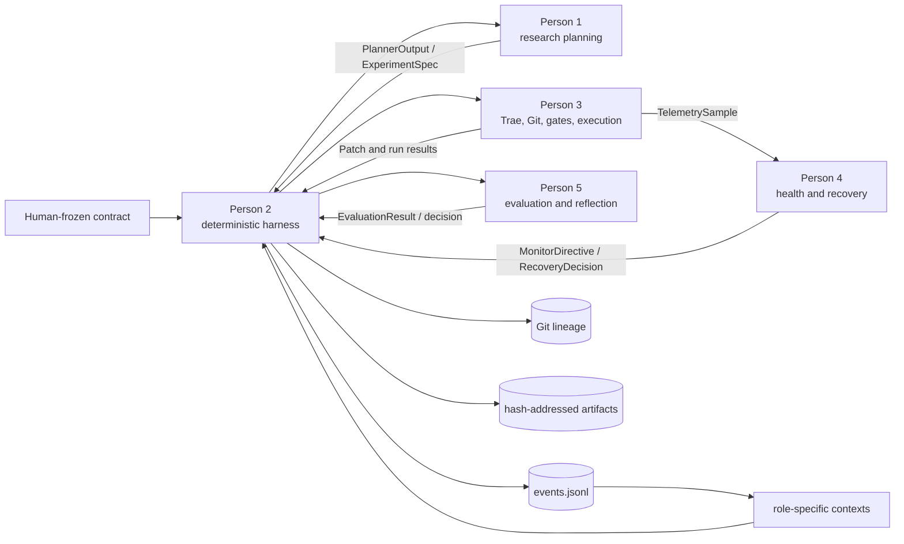

# TacoRank

TacoRank is a deterministic, evidence-tracked harness for autonomous recommender-system research on KuaiRand-Pure. It coordinates research planning, code generation, guarded execution, failure recovery, evaluation, and reflection without giving any LLM control over shared state, safety policy, or metric truth.

The repository is organized for five developers with one canonical schema and explicit typed handoffs. The controller owns orchestration; role components return values and never compete for control.

> **Current main status:** Persons 1–4 have implemented and tested component logic. Person 1 can use either a fake planner or the real DeepSeek provider; the other command-line adapters remain deterministic fakes. Person 5's evaluation and research-reflection paths remain scaffolds, so this is an integration-ready research harness—not yet a live autonomous training deployment.

## System architecture



The three authorities are:

- human rules in `contract/COMPETITION.md` and `PROTECTED_PATHS.md`;
- dynamic evidence in the append-only `runs/<run_id>/events.jsonl` ledger; and
- exact code lineage in Git.

Generated status, lesson, summary, context, and chart files are derived views—not independent sources of truth.

## Ownership and implementation status

| Role | Responsibility | Main paths | Current state |
| --- | --- | --- | --- |
| Person 1 | Evidence-grounded experiment planning and deterministic search policy | `src/tacorank/agents/`, `src/tacorank/research/`, `src/tacorank/providers/`, `research/` | Implemented with fake and DeepSeek providers |
| Person 2 | Shared schemas, append-only memory, contexts, orchestration, budgets, replay, resume and CLI | `src/tacorank/schemas.py`, `memory/`, `context/`, `orchestrator/`, `artifacts.py`, `cli.py` | P0 harness and fake lifecycle implemented |
| Person 3 | Trae coding worker, Git worktrees, Gate A, sandboxed execution, telemetry, artifacts and Gate B | `src/tacorank/coding/`, `git/`, `safety/`, `execution/` | Implemented and integration-tested; live runtime validation remains |
| Person 4 | SRE monitoring, failure classification, bounded recovery and operational reflection | `src/tacorank/sre/`, `src/tacorank/recovery/` | Implemented and failure-injection tested |
| Person 5 | Protected evaluation, trust decisions, stability, final selection and research reflection | `src/tacorank/evaluation/`, `reflection/`, `reporting/` | Evaluation/reflection scaffolds remain; basic derived reporting is implemented |

Only Person 2 appends events or changes controller state. Person 1 chooses research direction, Person 3 edits and executes candidate code, Person 4 interprets operational failures, and Person 5 owns metric truth.

## Repository layout

```text
src/tacorank/
  agents/            Person 1 planner adapter
  providers/         fake/provider-specific research model clients
  research/          search policy, experiment graph and method portfolio
  memory/            append-only event store and replay
  context/           bounded role-specific context construction
  orchestrator/      deterministic state machine and adapter routing
  coding/            pinned Trae adapter, prompts and redaction
  git/               experiment refs, patches and disposable worktrees
  safety/            protected manifests, Gate A and Gate B
  execution/         symbolic commands, sandbox, telemetry and artifacts
  sre/               live health observation
  recovery/          classification and bounded recovery policy
  evaluation/        Person 5 evaluation surface
  reflection/        operational/research lesson surfaces
  reporting/         reproducible derived views
solution/             only candidate area intended for coding-agent edits
research/methods/     reviewed experiment method cards
tests/                unit, integration and failure-injection coverage
contract/             human-frozen competition contract
runs/                 append-only run evidence and derived views
artifacts/            content-addressed run artifacts
kuairand-starter-kit/ starter-kit Git submodule
```

## Setup

TacoRank supports Python 3.9+. Initialize the starter-kit submodule, create an environment, install dependencies, and install the package:

```bash
git submodule update --init --recursive
python3 -m venv .venv
source .venv/bin/activate
python -m pip install -r requirements-dev.txt
python -m pip install --no-deps -e .
```

Run the complete suite:

```bash
python -m pytest -q
```

Useful component-level checks:

```bash
# Persons 1 and 2
python -m pytest tests/research tests/schemas tests/memory tests/context tests/orchestrator

# Person 3
python -m pytest tests/coding tests/git tests/safety tests/execution tests/failure_injection

# Person 4
python -m pytest tests/sre tests/recovery tests/integration/test_recovery_lifecycle.py
```

### Provider keys and Trae coding worker

No API key is needed for the test suite or a fully fake run. Provider keys are never stored in configuration files:

- `research_provider: "fake"` uses the deterministic Person 1 test planner and needs no key.
- `research_provider: "deepseek"` makes only Person 1 planning real and requires `DEEPSEEK_API_KEY` in the process environment.
- Live Trae is not selected by the current CLI, so `OPENAI_API_KEY` is not needed for coding yet.

For later live integration, install the pinned Trae worker in a separate Python 3.12+ environment:

```bash
python3.12 -m venv .venv-trae
.venv-trae/bin/python -m pip install -r requirements-trae.txt
```

Start from `config/trae-agent.yaml.example`, select a reviewed provider/model, and keep the final credential-free configuration outside Git. The example uses OpenAI and expects `OPENAI_API_KEY` only through the approved process environment. Never place credentials in this repository, YAML, prompts, logs, trajectories, fixtures, or artifacts.

## KuaiRand-Pure starter kit and data

Starter resources are tracked in `KuaiRand-Pure/` and through the `kuairand-starter-kit` submodule. The dataset itself is intentionally excluded from Git. Obtain it separately and follow [`docs/KUAIRAND_STARTER_KIT.md`](docs/KUAIRAND_STARTER_KIT.md) for the official split, baseline, evaluation, and submission contracts.

Do not change the protected evaluator, split logic, submission checker, or published baseline evidence from candidate code.

## Running the harness

The checked-in `contract/COMPETITION.md` and `PROTECTED_PATHS.md` are intentionally empty and fail closed. Before any run, humans must resolve the competition discrepancy, populate and freeze both files, verify the data/evaluator hashes, and copy `config.example.json` to a run-specific configuration.

The current CLI accepts `adapter_mode: "fake"` only for coding, execution, recovery, output checking, and evaluation. Person 1 planning is selected independently with `research_provider: "fake"` or `"deepseek"`. This exercises schemas, event transitions, replay, contexts, reporting, and adapter routing without claiming a real training result:

```bash
tacorank run --config run-config.json
tacorank resume --run-id run_001 --repository-root .
tacorank status --run-id run_001 --repository-root .
tacorank validate-ledger --run-id run_001 --repository-root .
tacorank rebuild-views --run-id run_001 --repository-root .
tacorank finalize --run-id run_001 --repository-root .
```

`finalize` deliberately refuses to fabricate success until a real clean-reproduction runner and evaluator are connected.

## Core guarantees

- All role boundaries use the canonical models in `src/tacorank/schemas.py`.
- Only the deterministic harness writes the event ledger or owns budgets, routing, convergence and final selection.
- Candidate execution requires an exact Gate A receipt bound to the commit, diff, contract and data identities.
- The runner resolves reviewed symbolic commands; it does not accept raw LLM shell commands.
- Candidate code cannot access protected evaluator labels or iterative hidden-final feedback.
- Person 3 owns termination mechanics; Person 4 returns typed health and recovery decisions.
- Gate B validates prediction structure and producer identity before Person 5 evaluation.
- Expected failures return typed results with redacted, hash-addressed evidence.
- Repair attempts and same-commit retries are bounded to prevent recovery loops.

## Collaboration rules

1. Import shared models from `src/tacorank/schemas.py`; do not create component-local replacements.
2. Preserve role ownership and communicate through typed adapter interfaces.
3. Never modify frozen contracts, protected paths, evaluator logic, data splits, or event history from candidate code.
4. Update affected fixtures and cross-component tests with every shared-schema change.
5. Keep datasets, credentials and local environments out of Git; preserve run evidence only under the team's reviewed evidence policy.
6. Run the complete test suite before requesting integration review.

## Current limitations

- The outer CLI can use a real DeepSeek planner, but coding, execution, recovery, output checking, and evaluation are still wired to fake adapters.
- Person 5's evaluator, trust, stability and research-reflection implementation is pending.
- `solution/` does not yet contain the real candidate training pipeline.
- Live Trae, production Docker, GPU and full-data runs have not been validated by this repository snapshot.
- GPU commands fail closed until the execution backend can prove a hard per-container GPU-memory limit.
- Human-owned contract, protected-path, data-manifest, evaluator and command-profile inputs must be finalized before live execution.

## Further documentation

- [`docs/HARNESS.md`](docs/HARNESS.md) — deterministic control plane, event flow and schema-change procedure
- [`docs/person3-handoff.md`](docs/person3-handoff.md) — coding, Git, safety and execution integration contract
- [`docs/research/planning-and-search.md`](docs/research/planning-and-search.md) — planning and search boundary
- [`docs/KUAIRAND_STARTER_KIT.md`](docs/KUAIRAND_STARTER_KIT.md) — dataset, baseline, evaluation and submission details
- [`TacoRank-Memory-Schema-v1.md`](TacoRank-Memory-Schema-v1.md) — event and memory schema reference
- [`research/CURRENT_RUN_IMPROVEMENT_PLAN.md`](research/CURRENT_RUN_IMPROVEMENT_PLAN.md) — reviewed initial research directions
