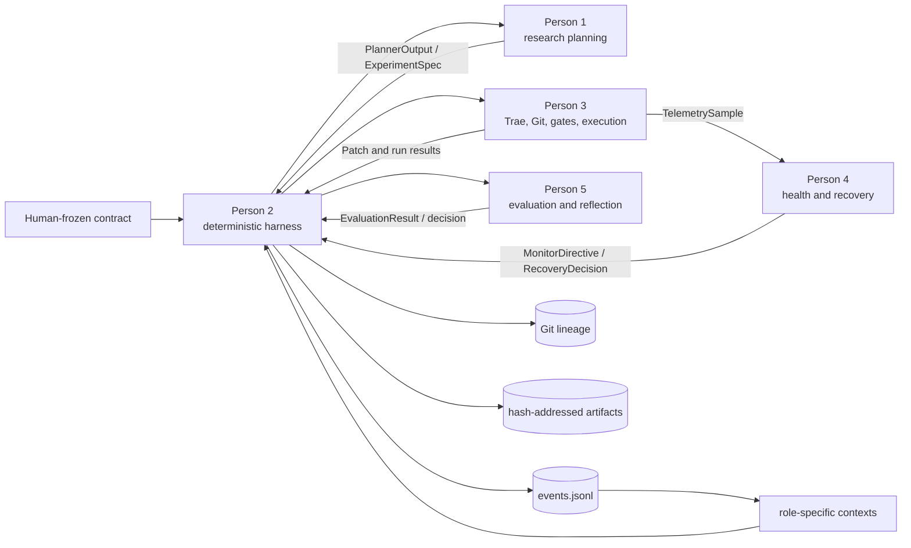

# TacoRank

TacoRank is a deterministic, evidence-tracked harness for autonomous recommender-system research on KuaiRand-Pure. It coordinates research planning, code generation, guarded execution, failure recovery, evaluation, and reflection without giving any LLM control over shared state, safety policy, or metric truth.

The repository is organized for five developers with one canonical schema and explicit typed handoffs. The controller owns orchestration; role components return values and never compete for control.

> **Current main status:** The production CLI composes DeepSeek planning, the pinned Trae coding worker, Gate A, Docker execution, SRE/recovery, Gate B, and protected evaluation. `tacorank setup-live` derives and hash-binds the machine-specific runtime, data views, official baseline, and configuration; `tacorank preflight` verifies them before any ledger event is created.

## System architecture



The three authorities are:

- human rules in `contract/COMPETITION.md` and `PROTECTED_PATHS.md`;
- dynamic evidence in the append-only `runs/<run_id>/events.jsonl` ledger; and
- exact code lineage in Git.

Generated status, lesson, summary, context, and chart files are derived views—not independent sources of truth.

## Ownership and implementation status

| Role | Responsibility | Main paths | Current state |
| --- | --- | --- | --- |
| Person 1 | Evidence-grounded experiment planning and deterministic search policy | `src/tacorank/agents/`, `src/tacorank/research/`, `src/tacorank/providers/`, `research/` | Implemented with fake and DeepSeek providers |
| Person 2 | Shared schemas, append-only memory, contexts, orchestration, budgets, replay, resume and CLI | `src/tacorank/schemas.py`, `memory/`, `context/`, `orchestrator/`, `artifacts.py`, `cli.py` | Canonical harness and production composition implemented |
| Person 3 | Trae coding worker, Git worktrees, Gate A, sandboxed execution, telemetry, artifacts and Gate B | `src/tacorank/coding/`, `git/`, `safety/`, `execution/` | Implemented and wired into production mode |
| Person 4 | SRE monitoring, failure classification, bounded recovery and operational reflection | `src/tacorank/sre/`, `src/tacorank/recovery/` | Implemented and failure-injection tested |
| Person 5 | Protected evaluation, trust decisions, stability, final selection and research reflection | `src/tacorank/evaluation/`, `reflection/`, `reporting/`, `benchmarks/kuairand_pure/` | Implemented and covered by evaluator, reflection and reporting tests |

Only Person 2 appends events or changes controller state. Person 1 chooses research direction, Person 3 edits and executes candidate code, Person 4 interprets operational failures, and Person 5 owns metric truth.

## Repository layout

```text
src/tacorank/
  agents/            Person 1 planner adapter
  providers/         fake/provider-specific research model clients
  research/          search policy, experiment graph and method portfolio
  memory/            append-only event store and replay
  context/           bounded role-specific context construction
  orchestrator/      deterministic state machine and adapter routing
  coding/            pinned Trae adapter, prompts and redaction
  git/               experiment refs, patches and disposable worktrees
  safety/            protected manifests, Gate A and Gate B
  execution/         symbolic commands, sandbox, telemetry and artifacts
  sre/               live health observation
  recovery/          classification and bounded recovery policy
  evaluation/        protected metrics, trust and experiment decisions
  reflection/        evidence-linked research lesson generation
  reporting/         reproducible derived views
solution/             only candidate area intended for coding-agent edits
research/methods/     reviewed experiment method cards
tests/                unit, integration and failure-injection coverage
contract/             human-frozen competition contract
runs/                 ignored run evidence and derived views
artifacts/            ignored content-addressed run artifacts
kuairand-starter-kit/ starter-kit Git submodule
```

## Setup

TacoRank supports Python 3.9+. Initialize the starter-kit submodule, create an environment, install dependencies, and install the package:

```bash
git submodule update --init --recursive
python3 -m venv .venv
source .venv/bin/activate
python -m pip install -r requirements-dev.txt
python -m pip install --no-deps -e .
```

Run the complete suite:

```bash
python -m pytest -q
```

Useful component-level checks:

```bash
# Persons 1 and 2
python -m pytest tests/research tests/schemas tests/memory tests/context tests/orchestrator

# Person 3
python -m pytest tests/coding tests/git tests/safety tests/execution tests/failure_injection

# Person 4
python -m pytest tests/sre tests/recovery tests/integration/test_recovery_lifecycle.py

# Person 5
python -m pytest tests/evaluation tests/reflection tests/reporting
```

### Provider key and Trae coding worker

Production uses one environment variable for both roles:

```bash
export DEEPSEEK_API_KEY='your-key'
```

Planning calls DeepSeek directly. The pinned Trae version uses an OpenAI-compatible client, so TacoRank maps the same key to that child process and fixes its base URL to DeepSeek. The key is never written to YAML, JSON, prompts, logs, trajectories, fixtures, or artifacts.

## KuaiRand-Pure starter kit and data

Starter resources are tracked in `KuaiRand-Pure/` and through the `kuairand-starter-kit` submodule. The dataset itself is intentionally excluded from Git. Obtain it separately and follow [`docs/KUAIRAND_STARTER_KIT.md`](docs/KUAIRAND_STARTER_KIT.md) for the official split, baseline, evaluation, and submission contracts.

Do not change the protected evaluator, split logic, submission checker, or published baseline evidence from candidate code.

## Fresh-clone production run

Prerequisites are Git, Docker with a running daemon, Python 3.9+ for TacoRank, Python 3.12 for the pinned Trae worker, and a DeepSeek API key. From a clean clone:

```bash
git submodule update --init --recursive
python3 -m venv .venv
.venv/bin/python -m pip install -r requirements-dev.txt
.venv/bin/python -m pip install --no-deps -e .

export DEEPSEEK_API_KEY='your-key'
.venv/bin/tacorank setup-live --download-data
.venv/bin/tacorank preflight \
  --config .tacorank/deployment/run-config.json \
  --live-config .tacorank/deployment/live-adapters.json
.venv/bin/tacorank run \
  --config .tacorank/deployment/run-config.json \
  --live-config .tacorank/deployment/live-adapters.json
```

If Python 3.12 or Docker is not on `PATH`, pass canonical executables with `--python312` and `--docker`. If the data is already present, omit `--download-data` and use `--data-dir` when needed. Setup requires a clean tracked checkout because the generated Docker image, Git baseline, contract, and protected manifest must all describe the same commit. The generated files are hash-bound to that exact `HEAD`; after committing source changes, generate a new deployment (or remove only the old generated deployment/runtime directories) before running preflight again.

### Windows PowerShell

Run PowerShell from the repository root. Docker Desktop must be running with
Linux containers enabled (the WSL2 backend is recommended). WSL integration is
needed only when running these commands from a WSL shell. The explicit
executable paths avoid PowerShell/PATH ambiguity:

```powershell
cd C:\nus\techjam\tacorank

git submodule update --init --recursive

if (-not (Test-Path .venv\Scripts\python.exe)) {
    py -3.12 -m venv .venv
}
.\.venv\Scripts\python.exe -m pip install -r requirements-dev.txt
.\.venv\Scripts\python.exe -m pip install --no-deps -e .

$env:DEEPSEEK_API_KEY = "your-key"
$python312 = (py -3.12 -c "import sys; print(sys.executable)").Trim()
$docker = (Get-Command docker.exe -ErrorAction Stop).Path

# Keep --download-data for the first setup (or when KuaiRand-Pure/data is incomplete).
.\.venv\Scripts\tacorank.exe setup-live `
    --download-data `
    --python312 $python312 `
    --docker $docker

.\.venv\Scripts\tacorank.exe preflight `
    --config .tacorank\deployment\run-config.json `
    --live-config .tacorank\deployment\live-adapters.json

.\.venv\Scripts\tacorank.exe run `
    --config .tacorank\deployment\run-config.json `
    --live-config .tacorank\deployment\live-adapters.json
```

The backtick is PowerShell's line-continuation character. Do not type the
backslash before it. Omit `--download-data` when the data is already complete.
Run `setup-live` only once for a deployment directory; if one already exists,
choose new `--deployment-dir` and `--runtime-dir` values. Each setup creates a
new hash-bound deployment. Native Windows uses Docker
Desktop's local `npipe://` endpoint; keep Docker Desktop in Linux-container
mode (the WSL2 backend is recommended).

### macOS

Run from a clean checkout with Docker Desktop running:

```bash
cd /path/to/tacorank
git submodule update --init --recursive

python3.12 -m venv .venv
.venv/bin/python -m pip install -r requirements-dev.txt
.venv/bin/python -m pip install --no-deps -e .

export DEEPSEEK_API_KEY='your-key'
PYTHON312="$(command -v python3.12)"
DOCKER="$(command -v docker)"

# Include --download-data only when KuaiRand-Pure/data is not already complete.
.venv/bin/tacorank setup-live --download-data \
  --python312 "$PYTHON312" \
  --docker "$DOCKER"

.venv/bin/tacorank preflight \
  --config .tacorank/deployment/run-config.json \
  --live-config .tacorank/deployment/live-adapters.json

.venv/bin/tacorank run \
  --config .tacorank/deployment/run-config.json \
  --live-config .tacorank/deployment/live-adapters.json
```

On Apple Silicon, Docker Desktop should use its default Linux/ARM64 engine;
the pinned runtime image must be available for the selected Docker
architecture. If the data directory is already complete, omit
`--download-data`. Do not run `setup-live` twice against the same deployment
directory. macOS uses Docker Desktop's local Unix socket.

Preflight is deliberately non-mutating with respect to run state. It verifies the clean baseline and exact submodule, frozen contract and protected paths, every data-manifest file, official evaluator and FM baseline, pinned Trae install/config/runtime, credential presence and DeepSeek model access, Docker daemon/image/environment, execution of the manifest-verified Trae edit tool through its read-only container mount, and the Docker tmpfs hard-output quota. A successful result reports `"ledger_created": false`.

After a run starts, inspect or rebuild its state with:

```bash
tacorank resume --run-id run_001 --repository-root .
tacorank status --run-id run_001 --repository-root .
tacorank validate-ledger --run-id run_001 --repository-root .
tacorank rebuild-views --run-id run_001 --repository-root .
tacorank finalize --run-id run_001 --repository-root .
```

Production never falls back to fake adapters. Deterministic fakes remain behind the explicit test-only flag. The production command is intentionally quiet while work is running and prints a final JSON status; inspect `runs/<run-id>/STATUS.md`, `SUMMARY.md`, and `events.jsonl` for the recorded outcome. `resume` currently validates/repairs the ledger tail and reports the recovery phase without restarting adapter execution. `finalize` still refuses to fabricate success because standalone clean reproduction/final selection is not implemented yet.

## Core guarantees

- All role boundaries use the canonical models in `src/tacorank/schemas.py`.
- Only the deterministic harness writes the event ledger or owns budgets, routing, convergence and final selection.
- Candidate execution requires an exact Gate A receipt bound to the commit, diff, contract and data identities.
- The runner resolves reviewed symbolic commands; it does not accept raw LLM shell commands.
- Candidate code cannot access protected evaluator labels or iterative hidden-final feedback.
- Person 3 owns termination mechanics; Person 4 returns typed health and recovery decisions.
- Gate B validates prediction structure and producer identity before Person 5 evaluation.
- Expected failures return typed results with redacted, hash-addressed evidence.
- Repair attempts and same-commit retries are bounded to prevent recovery loops.

## Collaboration rules

1. Import shared models from `src/tacorank/schemas.py`; do not create component-local replacements.
2. Preserve role ownership and communicate through typed adapter interfaces.
3. Never modify frozen contracts, protected paths, evaluator logic, data splits, or event history from candidate code.
4. Update affected fixtures and cross-component tests with every shared-schema change.
5. Keep datasets, credentials, submissions, model artifacts, sensitive run ledgers and local environments out of Git.
6. Run the complete test suite before requesting integration review.

## Current limitations

- Candidate execution is CPU-only; GPU commands fail closed until a hard per-container GPU-memory limit is available.
- `resume` reports the verified restart phase but does not yet restart adapter execution.
- `finalize` does not yet perform standalone clean reproduction and final selection.

## Further documentation

- [`docs/HARNESS.md`](docs/HARNESS.md) — deterministic control plane, event flow and schema-change procedure
- [`docs/person3-handoff.md`](docs/person3-handoff.md) — coding, Git, safety and execution integration contract
- [`docs/research/planning-and-search.md`](docs/research/planning-and-search.md) — planning and search boundary
- [`docs/KUAIRAND_STARTER_KIT.md`](docs/KUAIRAND_STARTER_KIT.md) — dataset, baseline, evaluation and submission details
- [`TacoRank-Memory-Schema-v1.md`](TacoRank-Memory-Schema-v1.md) — event and memory schema reference
- [`research/CURRENT_RUN_IMPROVEMENT_PLAN.md`](research/CURRENT_RUN_IMPROVEMENT_PLAN.md) — reviewed initial research directions
