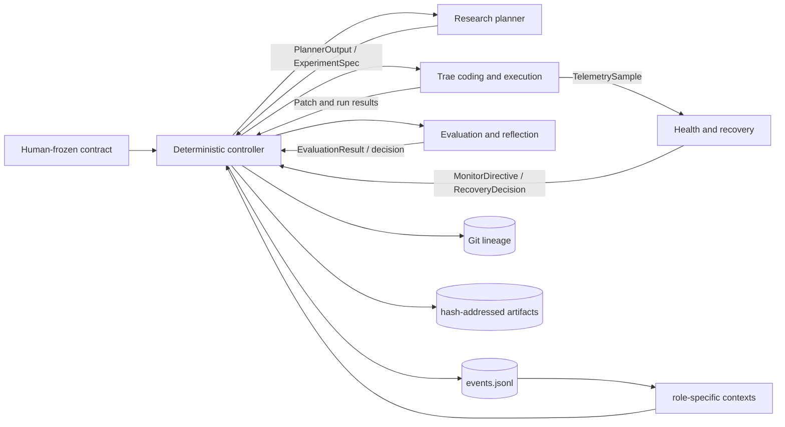

[简体中文](README.zh-CN.md) | **English**

# TacoRank

TacoRank is a deterministic, evidence-tracked harness for autonomous recommender-system research on KuaiRand-Pure. It connects research planning, Trae-based code generation, guarded CPU execution, failure recovery, protected evaluation, durable memory, convergence, and final submission checking in one reproducible workflow.

> **Status:** The complete CPU workflow is implemented. The deterministic suite passes, a bounded production run completed through official submission checking, and a separate live regression run continued correctly into a second research iteration. See [Validation status](#validation-status) for the exact evidence boundary and [Current limitations](#current-limitations) before running it.

## Contents

- [Features](#features)
- [Quick start](#quick-start)
- [Agent-assisted operation](#agent-assisted-operation)
- [Architecture](#architecture)
- [Requirements](#requirements)
- [Installation](#installation)
- [Configuration and end-to-end run](#configuration-and-end-to-end-run)
- [Trae-only coding validation](#trae-only-coding-validation)
- [Run operations](#run-operations)
- [Dataset and evaluation contract](#dataset-and-evaluation-contract)
- [Repository layout](#repository-layout)
- [Team ownership](#team-ownership)
- [Testing](#testing)
- [Validation status](#validation-status)
- [Safety and reproducibility](#safety-and-reproducibility)
- [Contributing](#contributing)
- [Troubleshooting](#troubleshooting)
- [Current limitations](#current-limitations)
- [Documentation](#documentation)
- [License](#license)

## Features

- A complete researcher → coding worker → Gate A → CPU execution → Gate B → evaluation → reflection loop.
- A deterministic controller that alone owns workflow state, budgets, recovery, convergence, promotion, rollback, and final selection.
- Production adapters for DeepSeek research planning and the pinned Trae coding worker, with isolated test doubles restricted to tests.
- Disposable Git worktrees, protected-path enforcement, symbolic execution commands, Docker isolation, resource limits, and typed recovery decisions.
- An append-only, hash-chained event ledger with replayable state, immutable evidence artifacts, and reproducible derived reports.
- KuaiRand-Pure evaluation fidelity: within-user ranking on `long_view`, protected GAUC and nDCG@5, label-free test inference, and official submission checking.

## Quick start

After completing [installation](#installation) and [deployment setup](#configuration-and-end-to-end-run), start the full autonomous workflow from the repository root with:

```bash
.venv/bin/tacorank run \
  --config .tacorank/deployment/run-config.json \
  --live-config .tacorank/deployment/live-adapters.json
```

This is the canonical end-to-end entry point. It runs one experiment at a time, rebuilds each planner context from durable memory, stops on a frozen convergence or resource rule, and finalizes the selected test submission automatically.

## Agent-assisted operation

[`AGENTS.md`](AGENTS.md) is the operational runbook for coding agents. It explains the system authorities and safety boundaries, development and Trae-only validation, complete live setup, monitoring, recovery, finalization, ledger validation, output inspection, and the evidence an agent must report.

You can give a repository-aware coding agent this instruction:

> Read `AGENTS.md` completely, inspect the current repository state, and help me set up and run the TacoRank workflow. Follow the documented credential and data boundaries, validate each stage with direct evidence, and do not claim completion until the requested completion contract is met.

The guide separates three evidence levels: deterministic development tests, real Trae-only coding validation, and a complete live autonomous ML run. Tell the agent which level you want before it starts provider calls, downloads, Docker builds, or long CPU execution.

## Architecture



TacoRank has three independent authorities:

- human-frozen rules in `contract/COMPETITION.md` and `PROTECTED_PATHS.md`;
- dynamic evidence in `runs/<run_id>/events.jsonl`; and
- exact code lineage in Git.

Only the controller may append events or change workflow state. Role components return typed values and cannot promote candidates, change budgets, access protected labels, or override evaluator truth. Generated state, reports, lessons, and experiment graphs are replayable views rather than additional sources of truth.

## Requirements

| Dependency | Requirement | Purpose |
| --- | --- | --- |
| Git | Submodule and worktree support | Starter-kit pinning and isolated candidate branches |
| Python | 3.9 or newer | TacoRank CLI and control plane |
| Python | 3.12.x | Isolated pinned Trae runtime created by setup |
| Docker | Running Docker-compatible daemon | Hardened Trae tools and CPU candidate execution |
| DeepSeek | `DEEPSEEK_API_KEY` with model access | Research planning and Trae coding |
| KuaiRand-Pure | Local official data, or network access for setup download | Training, evaluation, and submission generation |

The live workflow is CPU-only. On macOS, Docker Desktop or a Docker-compatible daemon such as Colima is sufficient.

## Installation

Clone the repository with its official starter-kit submodule, create a virtual environment, and install the reviewed dependencies:

```bash
git clone --recurse-submodules https://github.com/JellyPenguinnn/tacorank.git
cd tacorank
python3 -m venv .venv
.venv/bin/python -m pip install --upgrade pip
.venv/bin/python -m pip install -r requirements-dev.txt
.venv/bin/python -m pip install --no-deps -e .
.venv/bin/tacorank --help
```

Both the superproject and starter-kit submodule require repository access. Use authenticated HTTPS or your approved SSH configuration; never place a token in a remote URL. If the repository was cloned without submodules, initialize them with:

```bash
git submodule update --init --recursive
```

## Configuration and end-to-end run

Setup must run from a clean tracked checkout so the Git baseline, protected manifest, data views, Docker image, and generated configurations all describe the same commit. Give every independent run a unique identifier.

1. Export the credential in the shell. Never store it in a repository file.

   ```bash
   export DEEPSEEK_API_KEY='your-key'
   ```

2. Prepare the official data, baseline, pinned Trae runtime, Docker image, protected views, and hash-bound configuration.

   ```bash
   .venv/bin/tacorank setup-live \
     --run-id run_001 \
     --download-data
   ```

   If the official data already exists, omit `--download-data` and pass an absolute, non-symlinked path inside this checkout, such as `--data-dir /absolute/path/to/tacorank/KuaiRand-Pure/data`. If Python 3.12 or Docker is not on `PATH`, pass their canonical executables with `--python312` and `--docker`.

3. Run the non-mutating production preflight.

   ```bash
   .venv/bin/tacorank preflight \
     --config .tacorank/deployment/run-config.json \
     --live-config .tacorank/deployment/live-adapters.json
   ```

   Preflight verifies the clean Git baseline and submodule, frozen contracts, data manifest, official evaluator and FM baseline, Trae installation and model access, Docker runtime, read-only edit-tool mount, execution environment, and hard output quota. Success reports `"ledger_created": false`.

4. Start the complete autonomous loop.

   ```bash
   .venv/bin/tacorank run \
     --config .tacorank/deployment/run-config.json \
     --live-config .tacorank/deployment/live-adapters.json
   ```

`setup-live` writes credential-free generated files under ignored `.tacorank/`. The API key is passed only through the environment to the research provider and the isolated Trae child process; it is not written to configuration, prompts, logs, trajectories, fixtures, or artifacts.

## Trae-only coding validation

The production coding path can be validated before downloading data or running ML training. Docker is still required because Trae edit tools run inside the same hardened boundary used by the complete workflow.

```bash
.venv/bin/tacorank setup-trae
.venv/bin/tacorank trae-preflight \
  --config .tacorank/trae/trae-deployment.json \
  --local-only

export DEEPSEEK_API_KEY='your-key'
.venv/bin/tacorank trae-preflight \
  --config .tacorank/trae/trae-deployment.json
.venv/bin/tacorank trae-run-example \
  --config .tacorank/trae/trae-deployment.json \
  --input examples/trae/experiment-spec.json
```

The local-only preflight checks the pinned Trae runtime and Docker tool boundary without reading a credential. The live preflight authenticates to DeepSeek and verifies `deepseek-v4-flash` access with high reasoning. The example creates a real patch in a disposable worktree and applies Gate A, then deliberately stops before dataset access, training, evaluation, or ledger creation.

## Run operations

Use the same frozen deployment configurations for lifecycle operations:

```bash
# Continue only from a durable planning checkpoint.
.venv/bin/tacorank resume \
  --config .tacorank/deployment/run-config.json \
  --live-config .tacorank/deployment/live-adapters.json

# Inspect and verify durable state.
.venv/bin/tacorank status --run-id run_001 --repository-root .
.venv/bin/tacorank validate-ledger --run-id run_001 --repository-root .
.venv/bin/tacorank rebuild-views --run-id run_001 --repository-root .

# Finalize a stopped run if automatic finalization did not complete.
.venv/bin/tacorank finalize \
  --config .tacorank/deployment/run-config.json \
  --live-config .tacorank/deployment/live-adapters.json
```

`resume` repairs only an incomplete final JSONL fragment, validates the frozen run identity, and continues from an unambiguous `planning` or `planner_context` checkpoint. It fails closed during an ambiguous mid-adapter phase. `finalize` is idempotent for an already finalized run.

Each run writes the following ignored evidence tree:

```text
runs/<run_id>/
  events.jsonl                 authoritative append-only evidence
  state.json                   replayable state projection
  STATUS.md                    human-readable status
  contexts/                    immutable role contexts
  lessons/                     lesson and index projections
  experiment-graph/            graph and direction views
  artifacts/                   immutable attempt evidence
  reports/                     summary and resource projections
```

## Dataset and evaluation contract

Starter resources are tracked in `KuaiRand-Pure/` and in the pinned `kuairand-starter-kit` submodule. Downloaded data is intentionally excluded from Git.

Evaluation is within-user ranking over logged KuaiRand-Pure impressions using the native binary `long_view` target. The primary score is the mean of GAUC and nDCG@5. Candidate code cannot modify or read the protected evaluator, split identities, final labels, submission ordering, or official baseline evidence. Test inference is label-free and cannot feed back into search.

See [`docs/KUAIRAND_STARTER_KIT.md`](docs/KUAIRAND_STARTER_KIT.md) for data preparation, official splits, baseline reproduction, evaluation semantics, and submission checks.

## Repository layout

```text
src/tacorank/
  agents/            research planner adapter
  providers/         production model clients and provider contracts
  research/          search policy, experiment graph, and method portfolio
  memory/            append-only event store and replay
  context/           bounded role-specific context construction
  orchestrator/      deterministic state machine and adapter routing
  coding/            pinned Trae adapter, prompts, and redaction
  git/               experiment refs, patches, and disposable worktrees
  safety/            protected manifests, Gate A, and Gate B
  execution/         symbolic commands, Docker runner, and telemetry
  sre/               live health observation
  recovery/          classification and bounded recovery policy
  evaluation/        protected metrics, trust, and decisions
  reflection/        evidence-linked research lessons
  reporting/         reproducible derived views
benchmarks/           KuaiRand-specific adapters
solution/             only candidate area intended for coding-agent edits
research/methods/     reviewed experiment method cards
tests/                unit, integration, and failure-injection coverage
contract/             human-frozen competition contract
runs/                 ignored per-run evidence and reports
artifacts/            ignored shared artifact root
kuairand-starter-kit/ official starter-kit Git submodule
```

## Team ownership

| Role | Responsibility | Main paths |
| --- | --- | --- |
| Person 1 | Evidence-grounded planning and deterministic search policy | `agents/`, `providers/`, `research/` |
| Person 2 | Schemas, ledger, contexts, orchestration, budgets, replay, and CLI | `schemas.py`, `memory/`, `context/`, `orchestrator/`, `cli.py` |
| Person 3 | Trae, Git worktrees, Gate A, execution, telemetry, artifacts, and Gate B | `coding/`, `git/`, `safety/`, `execution/` |
| Person 4 | Health monitoring, failure classification, and bounded recovery | `sre/`, `recovery/` |
| Person 5 | Protected evaluation, trust, final selection, and reflection | `evaluation/`, `reflection/`, `reporting/`, `benchmarks/` |

Only Person 2's controller appends events. Other components own their domain logic and communicate through canonical models in `src/tacorank/schemas.py`.

## Testing

Run the complete deterministic suite before integration:

```bash
PYTHONPATH=src:. PYTHONPYCACHEPREFIX=/tmp/tacorank-pycache \
  .venv/bin/python -m pytest -q
```

Useful component-level checks:

```bash
# Research, schemas, memory, contexts, and orchestration
PYTHONPATH=src:. .venv/bin/python -m pytest \
  tests/research tests/schemas tests/memory tests/context tests/orchestrator

# Coding, Git, gates, execution, and failure injection
PYTHONPATH=src:. .venv/bin/python -m pytest \
  tests/coding tests/git tests/safety tests/execution tests/failure_injection

# Health and recovery
PYTHONPATH=src:. .venv/bin/python -m pytest \
  tests/sre tests/recovery tests/integration/test_recovery_lifecycle.py

# Evaluation, reflection, and reporting
PYTHONPATH=src:. .venv/bin/python -m pytest \
  tests/evaluation tests/reflection tests/reporting
```

Deterministic tests do not substitute for a live provider, Docker, data, or elapsed multi-iteration acceptance run. Keep those evidence classes separate when reporting results.

## Validation status

As of 2026-08-30:

- The complete automated suite passed: 470 tests at source commit `bdeed2f`.
- A bounded live CPU run used the production DeepSeek researcher, pinned Trae worker, hardened Docker runner, and official KuaiRand-Pure data.
- Trae produced a pairwise BPR candidate that changed only `solution/candidate.py`; all 14 Gate A checks and all 11 Gate B checks passed for both smoke and proxy execution.
- Protected proxy evaluation scored GAUC `0.62112551`, nDCG@5 `0.51277198`, and primary `0.56694875`, so the controller correctly pruned the candidate.
- The one-experiment budget selected the still-best official FM baseline and produced a manifest-attested 170,588-row test submission accepted by both TacoRank and the official checker. The 20-event ledger replayed successfully.
- A separate live iterative regression run completed its first real coding, Gate A, CPU smoke/proxy, Gate B, protected evaluation, and prune cycle, then durably created and proposed `exp_002` and entered its new Trae coding context. It was intentionally stopped during that second coding pass after the continuation behavior was observed.

This proves a real integrated baseline path and live cross-iteration continuation, not elapsed live convergence or a winning candidate. The bounded acceptance could not exercise three non-improving full iterations, and the candidate-best clean-reproduction path was not entered because the candidate failed proxy. Deterministic integration tests cover those control paths. Full evidence and scope are recorded in [`docs/person3-handoff.md`](docs/person3-handoff.md).

## Safety and reproducibility

- Gate A binds an accepted patch to its commit, diff, contract, protected manifest, and data identities before execution.
- The runner resolves reviewed symbolic commands and never accepts raw LLM shell commands.
- Candidate code runs in disposable worktrees and CPU Docker containers with bounded resources and output quotas.
- Gate B validates prediction structure, row identity, finiteness, and producer lineage before evaluation.
- Expected failures produce typed, redacted, hash-addressed evidence; repair and same-commit retries are bounded.
- Deliberate integrity violations terminate the run and remain in the ledger.
- Convergence counts terminal trusted full-fidelity research iterations, not confirmation-seed executions.
- Finalization selects only the validation best, requires clean reproduction for a candidate, and keeps test identities out of planning and evaluation feedback.
- Datasets, credentials, `.tacorank/`, submissions, environments, run ledgers, and generated artifacts are ignored and must never be committed.

## Contributing

Read [`AGENTS.md`](AGENTS.md) before making changes. In particular:

1. Keep behavior in its owning subsystem and use shared models from `src/tacorank/schemas.py`.
2. Preserve evaluator, split, prompt, seed, metric, protected-path, and ledger-history boundaries.
3. Update fixtures and cross-component tests whenever a shared schema or handoff changes.
4. Run the narrowest relevant tests, then the complete suite before integration review.
5. Keep data, secrets, submissions, generated evidence, and unrelated local changes out of commits.
6. In pull requests, document affected subsystems, commands run, data and split assumptions, seeds, metric changes, and residual limitations.

## Troubleshooting

| Symptom | Resolution |
| --- | --- |
| `setup-live` reports a dirty checkout | Preserve or commit intended tracked changes, then rerun setup from the exact clean commit that should anchor the experiment. |
| Python 3.12 or Docker cannot be found | Pass absolute executable paths with `setup-live --python312 ... --docker ...`. |
| Docker preflight cannot reach the daemon | Start Docker Desktop or the configured compatible daemon, then rerun `preflight`. |
| DeepSeek authentication or model preflight fails | Export a valid `DEEPSEEK_API_KEY` in the current shell; never place it in a tracked file. |
| The run identifier already has a ledger | Choose a new `--run-id` in `setup-live`; completed ledgers are immutable and are not reused for new runs. |
| `resume` rejects the current phase | The last durable state is mid-adapter and ambiguous. Preserve the ledger and evidence for operator review instead of fabricating a result. |

## Current limitations

- Candidate execution is CPU-only; GPU commands fail closed until a hard per-container GPU-memory limit is available.
- Automatic resume is supported only at durable planning checkpoints. A crash during a provider, coding, execution, or protected-evaluation call requires operator review at the last unambiguous boundary.
- Live success depends on the current machine, credential, provider, Docker daemon, network, and official data. Passing deterministic tests alone does not prove those external dependencies are available.
- The finalized live acceptance was intentionally bounded to one experiment. A later live run proved transition into a second iteration but was intentionally stopped there; neither is evidence of elapsed three-iteration convergence.

## Documentation

- [`docs/HARNESS.md`](docs/HARNESS.md) — control plane, event flow, finalization, and schema-change procedure
- [`docs/person3-handoff.md`](docs/person3-handoff.md) — Trae, Git, gate, execution, and live acceptance evidence
- [`docs/research/planning-and-search.md`](docs/research/planning-and-search.md) — planning and search boundary
- [`docs/KUAIRAND_STARTER_KIT.md`](docs/KUAIRAND_STARTER_KIT.md) — dataset, baseline, evaluation, and submission details
- [`TacoRank-Memory-Schema-v1.md`](TacoRank-Memory-Schema-v1.md) — event and memory schema reference
- [`research/CURRENT_RUN_IMPROVEMENT_PLAN.md`](research/CURRENT_RUN_IMPROVEMENT_PLAN.md) — reviewed initial research directions

## License

A repository-wide license has not yet been declared. Do not assume permission to redistribute TacoRank code. The bundled KuaiRand-Pure resources retain their upstream terms; see [`KuaiRand-Pure/LICENSE`](KuaiRand-Pure/LICENSE) and the pinned starter-kit submodule.
