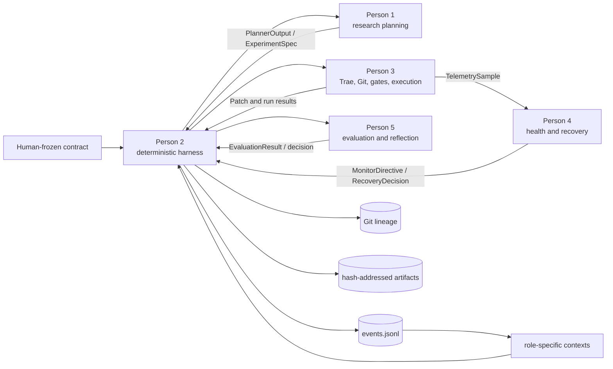

# TacoRank

TacoRank is a deterministic, evidence-tracked harness for autonomous recommender-system research on KuaiRand-Pure. It coordinates research planning, code generation, guarded execution, failure recovery, evaluation, and reflection without giving any LLM control over shared state, safety policy, or metric truth.

The repository is organized for five developers with one canonical schema and explicit typed handoffs. The controller owns orchestration; role components return values and never compete for control.

> **Current branch status:** The production CLI drives the complete sequential loop: DeepSeek research planning, pinned Trae coding, Gate A, isolated CPU execution, SRE and bounded recovery, Gate B, protected evaluation, durable reflection/memory, deterministic convergence or budget stop, clean reproduction, label-free test inference, and submission checking. `tacorank setup-live` derives and hash-binds the runtime, legal data views, official baseline, test-row submission contract, and configuration; `tacorank preflight` verifies them before the ledger is created.

## System architecture



The three authorities are:

- human rules in `contract/COMPETITION.md` and `PROTECTED_PATHS.md`;
- dynamic evidence in the append-only `runs/<run_id>/events.jsonl` ledger; and
- exact code lineage in Git.

Generated state, status, lesson, summary, resource, and graph files are derived
views—not independent sources of truth. Context and artifact files are immutable
evidence referenced by ledger events.

## Ownership and implementation status

| Role | Responsibility | Main paths | Current state |
| --- | --- | --- | --- |
| Person 1 | Evidence-grounded experiment planning and deterministic search policy | `src/tacorank/agents/`, `src/tacorank/research/`, `src/tacorank/providers/`, `research/` | Implemented with the production DeepSeek provider and isolated test doubles |
| Person 2 | Shared schemas, append-only memory, contexts, orchestration, budgets, replay, resume and CLI | `src/tacorank/schemas.py`, `memory/`, `context/`, `orchestrator/`, `artifacts.py`, `cli.py` | Canonical harness and production composition implemented |
| Person 3 | Trae coding worker, Git worktrees, Gate A, sandboxed execution, telemetry, artifacts and Gate B | `src/tacorank/coding/`, `git/`, `safety/`, `execution/` | Implemented and wired into production mode |
| Person 4 | SRE monitoring, failure classification, bounded recovery and operational reflection | `src/tacorank/sre/`, `src/tacorank/recovery/` | Implemented and failure-injection tested |
| Person 5 | Protected evaluation, trust decisions, stability, final selection and research reflection | `src/tacorank/evaluation/`, `reflection/`, `reporting/`, `benchmarks/kuairand_pure/` | Implemented and covered by evaluator, reflection and reporting tests |

Only Person 2 appends events or changes controller state. Person 1 chooses research direction, Person 3 edits and executes candidate code, Person 4 interprets operational failures, and Person 5 owns metric truth.

## Repository layout

```text
src/tacorank/
  agents/            Person 1 planner adapter
  providers/         production research-model client and provider contracts
  research/          search policy, experiment graph and method portfolio
  memory/            append-only event store and replay
  context/           bounded role-specific context construction
  orchestrator/      deterministic state machine and adapter routing
  coding/            pinned Trae adapter, prompts and redaction
  git/               experiment refs, patches and disposable worktrees
  safety/            protected manifests, Gate A and Gate B
  execution/         symbolic commands, sandbox, telemetry and artifacts
  sre/               live health observation
  recovery/          classification and bounded recovery policy
  evaluation/        protected metrics, trust and experiment decisions
  reflection/        evidence-linked research lesson generation
  reporting/         reproducible derived views
solution/             only candidate area intended for coding-agent edits
research/methods/     reviewed experiment method cards
tests/                unit, integration and failure-injection coverage
contract/             human-frozen competition contract
runs/                 ignored per-run evidence, artifacts, state, graph and reports
artifacts/            ignored legacy/shared artifact root retained for compatibility
kuairand-starter-kit/ starter-kit Git submodule
```

## Setup

TacoRank supports Python 3.9+. Initialize the starter-kit submodule, create an environment, install dependencies, and install the package:

```bash
git submodule update --init --recursive
python3 -m venv .venv
source .venv/bin/activate
python -m pip install -r requirements-dev.txt
python -m pip install --no-deps -e .
```

Run the complete suite:

```bash
python -m pytest -q
```

Useful component-level checks:

```bash
# Persons 1 and 2
python -m pytest tests/research tests/schemas tests/memory tests/context tests/orchestrator

# Person 3
python -m pytest tests/coding tests/git tests/safety tests/execution tests/failure_injection

# Person 4
python -m pytest tests/sre tests/recovery tests/integration/test_recovery_lifecycle.py

# Person 5
python -m pytest tests/evaluation tests/reflection tests/reporting
```

### Provider key and Trae coding worker

Production uses one environment variable for both roles:

```bash
export DEEPSEEK_API_KEY='your-key'
```

Planning calls DeepSeek directly. The pinned Trae version uses an OpenAI-compatible client, so TacoRank maps the same key to that child process and fixes its base URL to DeepSeek. The key is never written to YAML, JSON, prompts, logs, trajectories, fixtures, or artifacts.

### Trae-first validation (no dataset or ML training)

Person 3 can validate the production coding path independently before preparing KuaiRand-Pure or running a training command. This path uses `deepseek-v4-flash` with explicit high reasoning, the pinned Trae source, and the same hardened Docker edit boundary as a full run.

From a clean tracked checkout:

```bash
tacorank setup-trae
tacorank trae-preflight \
  --config .tacorank/trae/trae-deployment.json \
  --local-only

export DEEPSEEK_API_KEY='your-rotated-key'
tacorank trae-preflight \
  --config .tacorank/trae/trae-deployment.json
tacorank trae-run-example \
  --config .tacorank/trae/trae-deployment.json \
  --input examples/trae/experiment-spec.json
```

`setup-trae` installs and hash-attests the reviewed Trae runtime, builds a digest-pinned CPU Docker image, and writes a credential-free deployment file under ignored `.tacorank/`. The local-only preflight executes the reviewed edit tool through its read-only mount without reading an API key. The full preflight additionally authenticates to DeepSeek and verifies that `deepseek-v4-flash` is available. The example consumes a canonical `ExperimentSpec`, creates a real Trae patch in a disposable worktree, and applies Gate A; it deliberately stops before any dataset access, ML training, evaluation, or ledger creation.

Docker is required for the production Trae coding worker because all edit tools run inside the hardened container. It is not required for a raw DeepSeek API request. On macOS, Docker Desktop or a Docker-compatible daemon such as Colima is sufficient.

## KuaiRand-Pure starter kit and data

Starter resources are tracked in `KuaiRand-Pure/` and through the `kuairand-starter-kit` submodule. The dataset itself is intentionally excluded from Git. Obtain it separately and follow [`docs/KUAIRAND_STARTER_KIT.md`](docs/KUAIRAND_STARTER_KIT.md) for the official split, baseline, evaluation, and submission contracts.

Do not change the protected evaluator, split logic, submission checker, or published baseline evidence from candidate code.

## Fresh-clone production run

Prerequisites are Git, Docker with a running daemon, Python 3.9+ for TacoRank, Python 3.12 for the pinned Trae worker, and a DeepSeek API key. From a clean clone:

```bash
git submodule update --init --recursive
python3 -m venv .venv
.venv/bin/python -m pip install -r requirements-dev.txt
.venv/bin/python -m pip install --no-deps -e .

export DEEPSEEK_API_KEY='your-key'
.venv/bin/tacorank setup-live --download-data
.venv/bin/tacorank preflight \
  --config .tacorank/deployment/run-config.json \
  --live-config .tacorank/deployment/live-adapters.json
.venv/bin/tacorank run \
  --config .tacorank/deployment/run-config.json \
  --live-config .tacorank/deployment/live-adapters.json
```

`run` is the outer-loop command. It keeps one experiment active at a time, rebuilds the next planner context from the append-only ledger, and continues until a frozen stop rule matches. It then finalizes automatically. Confirmation seeds for one candidate remain part of that experiment and do not independently consume the three-iteration convergence patience.

If Python 3.12 or Docker is not on `PATH`, pass canonical executables with `--python312` and `--docker`. If the data is already present, omit `--download-data` and use `--data-dir` when needed. Setup requires a clean tracked checkout because the generated Docker image, Git baseline, contract, and protected manifest must all describe the same commit.

Preflight is deliberately non-mutating with respect to run state. It verifies the clean baseline and exact submodule, frozen contract and protected paths, every data-manifest file, official evaluator and FM baseline, pinned Trae install/config/runtime, credential presence and DeepSeek model access, Docker daemon/image/environment, execution of the manifest-verified Trae edit tool through its read-only container mount, and the Docker tmpfs hard-output quota. A successful result reports `"ledger_created": false`.

### Latest live CPU acceptance

The bounded `person3_autonomous_cpu_001` acceptance run on 2026-08-30 used the production DeepSeek researcher and pinned Trae worker with high reasoning, official KuaiRand data, and the CPU Docker sandbox. DeepSeek proposed a within-user pairwise BPR experiment; Trae changed only `solution/candidate.py` in eight steps. The patch passed all 14 Gate A checks, and smoke plus proxy execution each passed all 11 Gate B checks. Protected proxy evaluation returned GAUC `0.62112551`, nDCG@5 `0.51277198`, and primary `0.56694875`, so the controller honestly pruned the candidate.

The one-experiment acceptance budget then stopped the search, selected the still-best official FM baseline, and finalized a manifest-attested 170,588-row test submission. Both the controller check and the official `submit.py --check --split test` passed. The 20-event hash chain replayed successfully; total provider tokens were `192,521`, GPU use and manual interventions were zero, and the recorded agent elapsed time was `183.997` seconds.

This is a real integrated baseline acceptance, not a convergence claim: the bounded run intentionally could not demonstrate a live three-iteration convergence sequence, and the candidate-best clean-reproduction path was not entered because the candidate failed proxy. Deterministic integration tests cover those control paths. Earlier full-validation execution evidence and its corrected validation-vs-test boundary are recorded in [`docs/person3-handoff.md`](docs/person3-handoff.md).

After a run starts, inspect or rebuild its state with:

```bash
tacorank resume \
  --config .tacorank/deployment/run-config.json \
  --live-config .tacorank/deployment/live-adapters.json
tacorank status --run-id run_001 --repository-root .
tacorank validate-ledger --run-id run_001 --repository-root .
tacorank rebuild-views --run-id run_001 --repository-root .
tacorank finalize \
  --config .tacorank/deployment/run-config.json \
  --live-config .tacorank/deployment/live-adapters.json
```

The CLI has no fake execution mode: `run`, `resume`, and `finalize` rebuild the same hash-bound production adapters and require the frozen run and live configurations. Deterministic test doubles exist only in tests. `resume` repairs only an incomplete final JSONL fragment, verifies the frozen run identity, and continues from a durable `planning` or `planner_context` checkpoint. It fails closed at an ambiguous mid-adapter phase; it never fabricates the missing external result.

Finalization selects only the ledger's validation best. A candidate must pass a fresh full-validation `clean_reproduce`, reproduce the exact trusted score, run label-free `candidate_final_infer` on official test rows, pass Gate B, and pass the protected submission checker. If no candidate beat the baseline, the controller validates and copies the manifest-attested official FM test submission. Test identities are not available to planning or validation evaluation.

Each new run is organized as follows:

```text
runs/<run_id>/
  events.jsonl                 authoritative append-only evidence
  state.json                  overwriteable state projection
  STATUS.md                   human-readable current state
  contexts/                   immutable role contexts
  lessons/                    per-lesson and index projections
  experiment-graph/           graph JSON, overview and direction views
  artifacts/                  immutable run/experiment/attempt evidence
  reports/                    summary and resource projections
```

## Core guarantees

- All role boundaries use the canonical models in `src/tacorank/schemas.py`.
- Only the deterministic harness writes the event ledger or owns budgets, routing, convergence and final selection.
- Candidate execution requires an exact Gate A receipt bound to the commit, diff, contract and data identities.
- The runner resolves reviewed symbolic commands; it does not accept raw LLM shell commands.
- Candidate code cannot access protected evaluator labels or iterative hidden-final feedback.
- Person 3 owns termination mechanics; Person 4 returns typed health and recovery decisions.
- Gate B validates prediction structure and producer identity before Person 5 evaluation.
- Expected failures return typed results with redacted, hash-addressed evidence.
- Repair attempts and same-commit retries are bounded to prevent recovery loops.
- Deliberate integrity violations are recorded as recovery evidence and terminate the run.
- Convergence counts terminal trusted full-fidelity research iterations, not confirmation-seed executions.

## Collaboration rules

1. Import shared models from `src/tacorank/schemas.py`; do not create component-local replacements.
2. Preserve role ownership and communicate through typed adapter interfaces.
3. Never modify frozen contracts, protected paths, evaluator logic, data splits, or event history from candidate code.
4. Update affected fixtures and cross-component tests with every shared-schema change.
5. Keep datasets, credentials, submissions, model artifacts, sensitive run ledgers and local environments out of Git.
6. Run the complete test suite before requesting integration review.

## Current limitations

- Candidate execution is CPU-only; GPU commands fail closed until a hard per-container GPU-memory limit is available.
- Automatic resume is supported at durable planning checkpoints. A process crash in the middle of a provider, coding, execution, or protected-evaluation call requires operator review and retry from the last unambiguous boundary.
- Live acceptance remains machine-, credential-, and data-dependent. Passing the deterministic integration suite does not by itself prove that an external provider or Docker daemon is currently available.

## Further documentation

- [`docs/HARNESS.md`](docs/HARNESS.md) — deterministic control plane, event flow and schema-change procedure
- [`docs/person3-handoff.md`](docs/person3-handoff.md) — coding, Git, safety and execution integration contract
- [`docs/research/planning-and-search.md`](docs/research/planning-and-search.md) — planning and search boundary
- [`docs/KUAIRAND_STARTER_KIT.md`](docs/KUAIRAND_STARTER_KIT.md) — dataset, baseline, evaluation and submission details
- [`TacoRank-Memory-Schema-v1.md`](TacoRank-Memory-Schema-v1.md) — event and memory schema reference
- [`research/CURRENT_RUN_IMPROVEMENT_PLAN.md`](research/CURRENT_RUN_IMPROVEMENT_PLAN.md) — reviewed initial research directions
