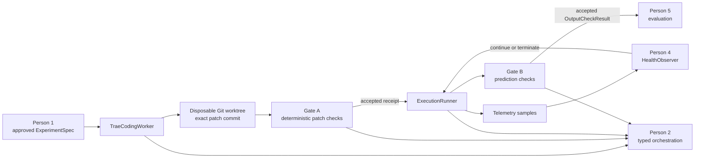

# TacoRank — Person 3 implementation

This branch implements TacoRank's trusted coding and execution boundary. It turns one controller-approved `ExperimentSpec` into an exact Git patch, checks that patch deterministically, runs an accepted commit through a sealed execution path, records telemetry and artifacts, and validates prediction structure before Person 5 evaluation.

The implementation is rebased on the current shared harness and uses the canonical models in `src/tacorank/schemas.py`. It does not duplicate Person 2's schemas, artifact authority, orchestration, event ledger, budgets, or routing logic.

For the detailed integration contract, see [`docs/person3-handoff.md`](docs/person3-handoff.md).

## End-to-end boundary



Person 3 owns mechanics and enforcement. It does not choose hypotheses, calculate official metrics, decide recovery policy, promote experiments, update memory, or append events directly.

## Implemented components

| Area | Main implementation | Reviewer focus |
| --- | --- | --- |
| Trae coding | `src/tacorank/coding/` | Bounded prompts, credential redaction, pinned runtime identity, exact trajectory and patch capture |
| Git lineage | `src/tacorank/git/` | Deterministic experiment branches, disposable worktrees, ancestry checks, exclusive leases and safe cleanup |
| Gate A | `src/tacorank/safety/patch_gate.py` | Fourteen deterministic checks and commit/diff/hash-bound acceptance receipts |
| Capability policy | `src/tacorank/safety/` | Editable/protected paths, data boundaries, imports, commands, network, dependencies and secret scanning |
| Execution | `src/tacorank/execution/` | Symbolic commands, process/container isolation, hard limits, telemetry, cleanup and typed results |
| Gate B | `src/tacorank/safety/output_gate.py` | Header, types, row count/order, identities, duplicate preservation, finite scores and producer seal |
| Candidate surface | `solution/` | The only research implementation area intended for Trae edits |

### Coding and Git guarantees

- Trae is pinned to source revision `e839e559ac61bdd0e057c375dd1dee391fee797d`; the executable, installation metadata, runtime package tree, YAML configuration and Docker image digest are verified before production use.
- Production Trae is edit-only: only `str_replace_based_edit_tool` and `task_done` are enabled. The unrestricted Bash tool is disabled.
- Credentials are accepted only from explicitly approved process-environment names. They are excluded from prompts, trajectories, artifacts and Git.
- Every initial patch and repair is committed on `experiment/<run_id>/<experiment_id>` with verified ancestry and exact diff bytes.
- Coding and execution acquire the same bounded OS-backed worktree lease, preventing concurrent modify-and-restore races.
- Gitlinks are allowed only through an explicit submodule allowlist and already-present local objects; candidate patches cannot advance submodule references.

### Gate A

Gate A is deterministic and does not ask an LLM whether code is safe. It checks:

1. diff parsing and reported-file equality;
2. editable and protected path boundaries;
3. traversal, symlink and submodule escape;
4. frozen contract and protected-manifest hashes;
5. syntax/import and required interfaces;
6. command, data, future-information and network policies;
7. secrets and dependency changes; and
8. an isolated tiny legal-data check when the controller supplies that capability.

An accepted patch receives a canonical receipt bound to the run, experiment, patch attempt, commit, immediate and cumulative diffs, contract, protected manifest and data manifest. Any repair commit requires a new receipt.

### Sealed execution

The runner accepts symbolic IDs only—never raw LLM shell strings:

- `baseline_full`
- `candidate_smoke`
- `candidate_proxy`
- `candidate_full`
- `candidate_final_infer`
- `submission_check`
- `clean_reproduce`

The registry resolves immutable argv, environment, work directory, expected artifacts and resource profiles. Commands run with `shell=False`.

Production Docker execution uses a read-only root filesystem, dropped capabilities, `no-new-privileges`, disabled network by default, bounded CPU/RAM/PIDs/tmpfs, a sanitized environment and an exact mount policy. Candidate workspaces are read-only during score-bearing execution. The attempt output directory is the only writable bind mount and must have a production-capable hard quota proof; `/tmp` is a bounded ephemeral tmpfs.

`submission_check` receives one controller-verified prior prediction through a read-only mount. Hidden input is permitted only for `candidate_final_infer`; evaluator labels are never mounted into candidate execution.

The runner always attempts to reap the full process group or container and normalizes expected failures into a typed `RunResult`. Person 4 receives live `TelemetrySample` values and can request termination, but only the runner sends termination signals.

### Gate B

Gate B verifies the prediction artifact before Person 5 can evaluate it. It requires a controller-owned `ExecutionSealExpectation` covering the exact run, attempt, command, commit, data manifest and Gate A receipt. It then checks the frozen output contract, including official row order, repeated user-item rows, finite numeric scores and artifact hashes. It does not calculate official ranking metrics.

## Integration with the shared harness

Person 2 can adapt the canonical artifact service directly:

```python
from pathlib import Path

from tacorank.artifacts import ArtifactStore
from tacorank.execution import CanonicalArtifactStoreAdapter

repository_root = Path(".").resolve()
artifacts = CanonicalArtifactStoreAdapter(ArtifactStore(repository_root))
```

Public fake adapters are also available for orchestration tests:

- `FakeCodingWorker`
- `FakePatchGate`
- `FakeExecutionRunner`
- `FakeOutputGate`

They return caller-supplied canonical models and do not create alternate production schemas.

## Setup

The TacoRank controller supports Python 3.9+:

```bash
git submodule update --init --recursive
python3 -m venv .venv
.venv/bin/python -m pip install -r requirements-dev.txt
.venv/bin/python -m pip install --no-deps -e .
```

Run the complete repository suite:

```bash
.venv/bin/python -m pytest -q
```

Run only the Person 3 and integration suites:

```bash
.venv/bin/python -m pytest \
  tests/coding tests/git tests/safety tests/execution \
  tests/failure_injection tests/integration
```

The real Trae worker uses a separate Python 3.12+ environment:

```bash
python3.12 -m venv .venv-trae
.venv-trae/bin/python -m pip install -r requirements-trae.txt
```

Start from `config/trae-agent.yaml.example`, but keep the final credential-free configuration outside Git and pass its exact hash through `TraeConfig`. Never place provider credentials in that YAML file.

## Current verification evidence

The branch was checked after rebasing onto the shared `main` implementation:

- 289 tests passed on Python 3.13;
- 289 tests passed on Python 3.12;
- the 29 Person 3 source files passed Python 3.9-targeted mypy;
- pyflakes, bytecode compilation, YAML parsing and Git diff checks passed; and
- canonical integration tests cover Person 2's schemas and `ArtifactStore`, coding output, Gate A, execution telemetry/results and Gate B rejection output.

CI repeats the Person 3 suites on Python 3.9 and 3.13 through `.github/workflows/person3.yml`.

## Required deployment inputs and limitations

The checked-in `contract/COMPETITION.md` and `PROTECTED_PATHS.md` remain intentionally empty human-owned scaffolds. Live execution must not start until the team freezes them and supplies their verified hashes. The controller must also provide legal data views, a data-manifest hash, reviewed entrypoints, symbolic-command configuration and Person 4's `HealthObserver`.

Live Trae, production Docker, GPU and full-data runs were not performed in the local verification environment. This branch therefore claims implementation and automated integration coverage—not live training or benchmark evidence.

GPU commands currently fail closed because the Docker backend cannot prove a hard per-container GPU-memory limit. They should be enabled only after an enforcement backend supplies that guarantee.

The KuaiRand starter source is included through the `kuairand-starter-kit` submodule. Dataset archives and extracted data are intentionally excluded from Git; reviewers must obtain them separately under the competition's data terms.

## Suggested review order

1. Read [`docs/person3-handoff.md`](docs/person3-handoff.md) for integration requirements.
2. Review `src/tacorank/coding/trae_adapter.py` and `src/tacorank/git/worktrees.py` for the coding boundary and lineage invariants.
3. Review `src/tacorank/safety/patch_gate.py` and `src/tacorank/safety/receipts.py` for Gate A authorization.
4. Review `src/tacorank/execution/runner.py`, `sandbox.py` and `seals.py` for launch, cleanup and evidence binding.
5. Review `src/tacorank/safety/output_gate.py` for the evaluator handoff.
6. Run `tests/failure_injection/` and `tests/integration/test_person3_vertical_slice.py` before approving integration changes.
