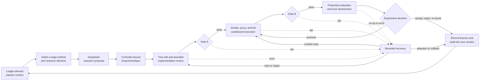

[简体中文](README.zh-CN.md) | **English**

# TacoRank

TacoRank is a deterministic, event-sourced research harness for autonomous
recommender-system experiments on the KuaiRand-Pure benchmark. It combines
research planning, method-card retrieval, Trae-based code generation, guarded
execution, failure recovery, protected evaluation, reflection, convergence,
and final submission checking.

The project is designed to answer two questions at the same time:

1. Can an autonomous agent discover and implement useful recommender-system
   changes?
2. Can every decision, metric, failure, recovery action, resource cost, and
   final artifact be reproduced and audited?

TacoRank is a control-plane system rather than a standalone recommender model.
The candidate model surface is solution/, while the control plane owns the
experiment lifecycle and the frozen competition contract.

## Project overview

The complete workflow is:

    Frozen contract and verified official FM baseline
        -> ledger-derived planner context
        -> deterministic selection of one legal, reviewed method card
        -> bounded advisory references from the hash-bound paper bank
        -> code-blind DeepSeek ResearchProposal
        -> controller-bound ExperimentSpec
        -> Trae edit in a disposable Git worktree
        -> plan-to-code review and bounded revision
        -> Gate A patch and lineage verification
        -> CPU smoke, proxy, and full execution
        -> telemetry, Gate B verification, and bounded recovery
        -> protected evaluation and reflection
        -> next experiment or deterministic stop
        -> clean reproduction of the validation-best candidate
           or protected FM fallback
        -> label-free final inference, final Gate B, and official submission check

### Lifecycle of one experiment

The controller is deterministic and is the only component allowed to mutate
workflow state or append the event ledger. External agents return typed
records; they cannot select the final checkpoint, alter budgets, bypass a
gate, access hidden labels, or rewrite the evaluator.

The current research portfolio includes an eligibility-gated causal
rolling-feedback residual blend combining causal history, diverse compact
rankers, and residual correction. The reviewed method-card portfolio spans
pairwise and listwise objectives, compact rankers, causal history, auxiliary
engagement signals, duration bias, temporal drift, and ensemble methods.
Preconditions, prohibitions, and prior negative results determine which cards
are legally selectable.

## Current architecture

The implementation uses the src/tacorank namespace. The main components are:

| Component | Responsibility | Main paths |
| --- | --- | --- |
| Research planner | Selects legal research families and method cards, validates proposals, and applies search/convergence policy. | src/tacorank/agents, src/tacorank/providers, src/tacorank/research, research/methods |
| Context and contracts | Builds bounded role-specific contexts and validates shared handoff schemas. | src/tacorank/context, src/tacorank/schemas.py |
| Orchestrator | Runs the state machine, owns budgets, routes adapters, and appends events. | src/tacorank/orchestrator |
| Event memory | Stores the append-only hash-chained ledger and replayable projections. | src/tacorank/memory, runs |
| Trae coding | Creates patches in disposable worktrees, captures trajectories, and coordinates bounded implementation review. | src/tacorank/coding, src/tacorank/git |
| Guardrails | Enforces protected paths, data boundaries, command policy, Gate A, and Gate B. | src/tacorank/safety, PROTECTED_PATHS.md |
| Execution and SRE | Runs reviewed symbolic commands in Docker, monitors health/resources, and records artifacts. | src/tacorank/execution, src/tacorank/sre |
| Recovery | Classifies failures and selects bounded repair, retry, rollback, or abandon actions. | src/tacorank/recovery |
| Evaluation and reporting | Computes protected metrics, trust diagnostics, decisions, lessons, resource reports, and final selection. | src/tacorank/evaluation, src/tacorank/reflection, src/tacorank/reporting |
| Benchmark adapters | Connects the controller to the official KuaiRand-Pure evaluator and submission checker. | benchmarks/kuairand_pure, kuairand-starter-kit |
| Candidate solution | The only normal coding-agent-editable model surface. | solution |
| Dashboard | Reads repository-backed ledgers and displays runs, experiments, gates, metrics, recovery, and token usage. | ui |

The integration flow uses canonical shared records in src/tacorank/schemas.py:

    ExperimentSpec -> PatchCandidate -> PatchCheckResult
        -> RunResult -> OutputCheckResult -> EvaluationResult
        -> RecoveryDecision and durable reflection/reporting records

### Gate A and Gate B

Gate A asks whether a proposed code change is safe and legal to execute. It
checks the diff, target files, Git lineage, contract and protected-path
identity, syntax/imports, interface requirements, command policy, data and
network boundaries, secret scans, dependencies, and the applicable smoke
check.

Gate B asks whether the generated prediction artifact is valid and eligible
for evaluation or submission. It checks row count, headers, row IDs, user/video
alignment, finite scores, duplicate preservation, score diversity, artifact
identity, and producer lineage.

A patch can pass Gate A and still fail during model execution. A successful
execution can pass Gate B and still be rejected by protected evaluation if it
does not improve reliably over the parent.

### Authority and safety boundaries

- contract/COMPETITION.md is the frozen benchmark contract.
- PROTECTED_PATHS.md defines immutable and denied paths.
- runs/<run_id>/events.jsonl is the authoritative dynamic evidence.
- Git commits and Gate A receipts establish executable lineage.
- State files, reports, lessons, and experiment graphs are replayable views.
- Candidate code is restricted to approved data and is run without network
  access.
- Test labels and hidden-final feedback never enter planning, search, or local
  metric feedback.
- The official evaluator and submission checker are protected.

## Requirements

For the control plane:

- Git with submodule and worktree support.
- Python 3.9 or newer.
- A local Docker-compatible daemon for live runs.

For the production Trae path:

- A canonical Python 3.12 executable.
- Docker Desktop or another approved Docker-compatible runtime.
- DeepSeek access through the DEEPSEEK_API_KEY environment variable.

For benchmark execution:

- The pinned kuairand-starter-kit submodule.
- Official KuaiRand-Pure data under KuaiRand-Pure/data, or authorization to
  download it during setup.

The production candidate workflow is CPU-only. GPU-hours are still tracked in
the common resource schema so future execution backends can be added without
changing the evidence contract.

## Setup and installation

### Clone and initialize the repository

    git clone --recurse-submodules https://github.com/JellyPenguinnn/tacorank.git
    cd tacorank
    git submodule update --init --recursive

Use the human team's configured HTTPS or SSH authentication. Do not put access
tokens in Git URLs.

### Install the control plane

    python3 -m venv .venv
    .venv/bin/python -m pip install --upgrade pip
    .venv/bin/python -m pip install -r requirements-dev.txt
    .venv/bin/python -m pip install --no-deps -e .
    .venv/bin/tacorank --help

The repository must be clean before creating a live deployment. Preserve
existing changes and use a new clean checkout or commit only when the team has
explicitly authorized it.

### Prepare a live deployment

Export the provider credential in the shell that launches the run. It is never
written to a repository file, configuration file, trajectory, or report.

    export DEEPSEEK_API_KEY='your-key'

Choose a new run identity for every independent attempt:

    REPO_ROOT="$(pwd -P)"
    RUN_ID="run_001"
    DEPLOYMENT_DIR="$REPO_ROOT/.tacorank/deployments/$RUN_ID"
    RUNTIME_DIR="$(dirname "$REPO_ROOT")/.tacorank-runtime/$(basename "$REPO_ROOT")-$RUN_ID"
    DATA_DIR="$REPO_ROOT/KuaiRand-Pure/data"

If the official data is already present and complete, omit
--download-data. Otherwise setup can download and verify the data:

    .venv/bin/tacorank setup-live \
      --repository-root "$REPO_ROOT" \
      --deployment-dir "$DEPLOYMENT_DIR" \
      --runtime-dir "$RUNTIME_DIR" \
      --data-dir "$DATA_DIR" \
      --run-id "$RUN_ID" \
      --download-data

If Python 3.12 or Docker is not on PATH, pass their absolute executable paths
with --python312 and --docker. Setup creates credential-free, hash-bound
configuration, protected benchmark views, baseline predictions, the pinned
Trae environment, and a digest-bound Docker image.

## Reproducing and validating results

There are three different reproduction tasks.

| Goal | What it requires | What it proves |
| --- | --- | --- |
| Verify a recorded run | Its intact `runs/<run_id>/` evidence directory | The archived ledger and reported outcome are internally valid. |
| Reproduce the FM baseline | Official KuaiRand-Pure data | The pinned official baseline produces the reported benchmark metrics. |
| Run TacoRank again | Data, Docker, Python 3.12, and DeepSeek access | A new autonomous workflow can complete under the frozen contract. |

### Path A — verify the recorded evidence run

The reference run ID is `run_20260830094907711_3c78fb3c`. Run evidence is
intentionally excluded from Git, so a fresh clone does **not** contain this
ledger. To verify the exact historical run, first obtain its intact evidence
directory and keep it at:

    runs/run_20260830094907711_3c78fb3c/

Then, from the repository root, run:

    REPO_ROOT="$(pwd -P)"
    RUN_ID="run_20260830094907711_3c78fb3c"

    test -f "$REPO_ROOT/runs/$RUN_ID/events.jsonl"

    .venv/bin/tacorank status \
      --run-id "$RUN_ID" \
      --repository-root "$REPO_ROOT"

    .venv/bin/tacorank validate-ledger \
      --run-id "$RUN_ID" \
      --repository-root "$REPO_ROOT"

The expected ledger-validation result is:

    valid: 135 events, head=825d62ab2f77ac0791d91d47d6d6b98925708eb9eb9a2e96593ddb5a6056430a

The status must report `status=finalized`, `phase=finalized`, stop reason
`no_legal_proposal`, final experiment `baseline`, and a final
`submission.checked` event. To regenerate the human-readable views from the
validated ledger, run:

    .venv/bin/tacorank rebuild-views \
      --run-id "$RUN_ID" \
      --repository-root "$REPO_ROOT"

Then inspect:

    runs/<run_id>/STATUS.md
    runs/<run_id>/reports/SUMMARY.md
    runs/<run_id>/reports/RESOURCES.md
    runs/<run_id>/events.jsonl

The recorded outcome was:

| Item | Result |
| --- | ---: |
| Official FM baseline GAUC | 0.6671326322 |
| Official FM baseline nDCG@5 | 0.5358048805 |
| Official FM baseline primary | 0.6014687564 |
| Best research candidate | `exp_006` |
| Best candidate primary | 0.6022983341 |
| Experiments proposed | 6 |
| Full evaluations completed | 9 |
| Stop reason | `no_legal_proposal` |
| Final selected experiment | `baseline` |
| Submission check | accepted |
| Provider tokens | 2,454,526 |
| GPU-hours | 0 |
| Manual interventions | 0 |

The candidate score was classified as within noise, so the protected FM
baseline remained the validation-best eligible selection. This proves that the
complete workflow finalized successfully; it does not prove that autonomous
research improved the benchmark.

### Path B — reproduce the official FM baseline

This path checks the benchmark number without calling DeepSeek or running the
autonomous loop. After placing the official data under
`KuaiRand-Pure/data/`, run from the repository root:

    REPO_ROOT="$(pwd -P)"

    .venv/bin/python kuairand-starter-kit/baseline.py \
      --data_dir "$REPO_ROOT/KuaiRand-Pure/data" \
      --model fm

The expected validation metrics are GAUC `0.6671326322`, nDCG@5
`0.5358048805`, and primary mean `0.6014687564`. This reproduces only the
official FM baseline, not the autonomous experiment history or final
submission workflow.

### Path C — run a new complete autonomous workflow

First complete [Setup and installation](#setup-and-installation), including
the live deployment in the preceding section. That setup defines
`REPO_ROOT`, `RUN_ID`, `DEPLOYMENT_DIR`, and `RUNTIME_DIR`. Then run:

    RUN_CONFIG="$DEPLOYMENT_DIR/run-config.json"
    LIVE_CONFIG="$DEPLOYMENT_DIR/live-adapters.json"

    .venv/bin/tacorank preflight \
      --config "$RUN_CONFIG" \
      --live-config "$LIVE_CONFIG"

Preflight must exit successfully and report:

    {"ledger_created": false, "runtime": "live", "status": "passed"}

Only after preflight passes, start the paid live workflow and leave it attached
until it returns:

    .venv/bin/tacorank run \
      --config "$RUN_CONFIG" \
      --live-config "$LIVE_CONFIG"

After the command returns, validate the new run:

    .venv/bin/tacorank status \
      --run-id "$RUN_ID" \
      --repository-root "$REPO_ROOT"

    .venv/bin/tacorank validate-ledger \
      --run-id "$RUN_ID" \
      --repository-root "$REPO_ROOT"

A successful complete run must have `status=finalized`, `phase=finalized`, a
selected final experiment or protected baseline fallback, an accepted
submission check, and a valid ledger. If any of these is absent, preserve the
run evidence and treat the workflow as incomplete.

The controller makes deterministic decisions from recorded inputs, but
DeepSeek and Trae are external model calls. A new run therefore does not
promise the same proposals, patches, experiment count, or final metric as the
reference run. It creates a new auditable result under the same frozen rules.

## Monitoring and dashboard

The optional UI is a local repository-backed dashboard. It reads runs and
events rather than becoming a second source of truth. It displays experiment
plans, parent/child lineage, Gate A, execution, Gate B, evaluation, recovery,
resource accounting, and provider token usage.

To run it:

    cd ui
    npm install
    npm run dev

To validate the UI:

    npm run lint
    npm run build

The dashboard asks for the provider key through a masked field when starting
a run. The key is passed to the local launcher and is not saved in browser
storage, run metadata, launcher logs, or API responses.

## Repository layout

    src/tacorank/
      agents/          research planning adapters
      providers/       DeepSeek and provider contracts
      research/        method cards, search policy, graph, and convergence
      context/         bounded planner, coder, and recovery contexts
      schemas.py       canonical shared event and handoff schemas
      orchestrator/    deterministic state machine and routing
      memory/          event store, replay, and projections
      coding/          Trae adapter, prompts, verifier, and redaction
      git/             disposable worktrees, refs, and patch mechanics
      safety/          protected paths, command policy, Gate A, and Gate B
      execution/       symbolic commands, Docker execution, and telemetry
      sre/             heartbeat, health, anomaly, and resource observation
      recovery/        failure classification and bounded recovery policy
      evaluation/      metrics, trust, comparisons, and final selection
      reflection/      reusable lessons and research reflection
      reporting/       results, resources, charts, and experiment trees
    solution/          candidate model and feature implementation surface
    research/methods/  reviewed method cards
    benchmarks/       KuaiRand-specific evaluator/submission adapters
    kuairand-starter-kit/
                       pinned official starter kit submodule
    contract/          human-frozen competition contract
    tests/             unit, integration, and failure-injection tests
    runs/              ignored per-run ledgers and evidence
    ui/                optional local run dashboard

## Team member contributions

This is a non-solo project. The conceptual role split below is mapped to the
actual src/tacorank architecture. All members integrate through the canonical
schemas and the controller-owned event ledger.

### Person 1 — San Chian: planning and experiment search

Research references: AIDE, UCB node selection, and the AIDE ML repository.

Responsibilities:

- Define experiment nodes, hypotheses, parents, children, target files, and
  fidelity.
- Maintain experiment lineage and allow branching from promising historical
  nodes.
- Implement UCB-style exploration/exploitation decisions.
- Generate feature, model, loss, training-strategy, hyperparameter, and
  ensemble experiment proposals.
- Promote proxy candidates to full evaluation only when policy permits.
- Prune weak branches and detect convergence using the official rule.
- Explain and record why each node was selected.
- Provide experiment-tree views for the dashboard.

Actual ownership mapping:

- src/tacorank/research/search_policy.py
- src/tacorank/research/portfolio.py
- src/tacorank/research/graph_view.py
- src/tacorank/research/convergence_advisor.py
- src/tacorank/orchestrator/convergence.py
- research/CURRENT_RUN_IMPROVEMENT_PLAN.md
- docs/research/planning-and-search.md

Primary output: a validated ExperimentSpec derived from experiment history,
method cards, budget, and convergence state.

### Person 2 — Jing Min: agent harness and Trae integration

Research references: ReAct, Karpathy's autoresearch loop, autoresearch program
design, and Trae Agent.

Responsibilities:

- Implement the planner-to-coder-to-reviewer handoff.
- Build bounded reason, action, tool, observation, and revision loops.
- Construct the context supplied to Trae.
- Launch Trae in the correct disposable Git worktree.
- Request a patch rather than uncontrolled repository modification.
- Capture trajectories, diffs, structured model responses, and provider usage.
- Enforce step, wall-time, and token limits.
- Provide mock providers and the top-level CLI for testing.
- Keep Trae from selecting the final experiment or judging its own result.

Actual ownership mapping:

- src/tacorank/agents/
- src/tacorank/providers/
- src/tacorank/coding/trae_adapter.py
- src/tacorank/coding/prompts.py
- src/tacorank/coding/output_parser.py
- src/tacorank/context/
- src/tacorank/cli.py
- docs/HARNESS.md

Primary output: a typed PatchCandidate with changed files, patch identity,
trajectory evidence, and an explanation.

### Person 3 — Li Hao: guardrails and contract verification

Research references: VeriGuard, RubricRefine, and Trae's tool system.

Responsibilities:

- Define protected files, editable roots, data boundaries, and command policy.
- Validate Git diffs before execution.
- Block edits to the evaluator, split definitions, hidden-test boundary,
  submission checker, and ledger authority.
- Check syntax, imports, interfaces, allowed dependencies, and network policy.
- Validate predictions for row count, order, alignment, finiteness, duplicate
  preservation, and producer identity.
- Maintain official-file checksums and detect temporal leakage.
- Keep component contracts practical and runtime-enforceable.

Actual ownership mapping:

- src/tacorank/safety/
- src/tacorank/coding/solution_verifier.py
- src/tacorank/git/patches.py
- src/tacorank/git/refs.py
- src/tacorank/git/worktrees.py
- benchmarks/kuairand_pure/
- PROTECTED_PATHS.md
- tests/safety/
- docs/person3-handoff.md

Primary output: an accepted or rejected patch/output verification result with
machine-readable violations and bounded repair instructions.

### Person 4 — Wai Hong: execution and immediate recovery

Research references: Self-Debugging, Reflexion, ByteRobust principles, and the
autoresearch failure-handling loop.

Responsibilities:

- Create isolated worktrees and execute reviewed commands in Docker.
- Monitor process heartbeat, runtime, CPU/GPU memory, disk, NaN loss, and
  missing outputs.
- Classify syntax/import, data, OOM, numerical, timeout, hang, contract, and
  infrastructure failures.
- Apply bounded self-debugging and targeted retries.
- Reduce approved runtime settings after OOM when policy allows.
- Roll back failed patches and resume from checkpoints where supported.
- Persist raw runtime events, artifacts, telemetry, recovery decisions, and
  resource usage.
- Keep immediate recovery separate from long-term research memory.

Actual ownership mapping:

- src/tacorank/execution/
- src/tacorank/sre/
- src/tacorank/recovery/
- tests/failure_injection/
- tests/recovery/
- AGENTS.md and docs/HARNESS.md

Primary output: a typed RunResult plus recovery events, checkpoint identity,
runtime totals, and artifact references.

### Person 5 — Ee Syuen: evaluation, reflection, memory, and evidence

Research focus: official evaluation, statistical validation, adaptive holdout
risk, Reflexion memory, method knowledge, and final judge evidence.

Responsibilities:

- Wrap the official evaluator and parse GAUC, nDCG@5, and primary.
- Compare each result with the baseline, parent, and current best.
- Reject NaN, Inf, missing rows, duplicated IDs, and misaligned submissions.
- Keep hidden-test information outside planning and convergence.
- Track multi-seed mean, standard deviation, user-level bootstrap intervals,
  minimum improvement thresholds, temporal holdouts, and slice results.
- Detect suspicious improvements, validation noise, and leakage with Person 3.
- Produce search feedback containing score, deltas, uncertainty, cost,
  stability, suspiciousness, and a promotion recommendation.
- Generate concise reusable lessons after an experiment has enough evidence.
- Own the method-card and experiment-lesson knowledge base.
- Aggregate tokens, CPU time, GPU-hours, wall-clock time, interventions,
  recovery rate, experiments attempted, and experiments promoted/discarded.
- Generate the final results table, evidence reports, experiment-tree data,
  resource charts, and submission artifacts.

Actual ownership mapping:

- src/tacorank/evaluation/
- src/tacorank/reflection/
- src/tacorank/memory/retrieval.py and replay-facing projections
- src/tacorank/reporting/
- benchmarks/kuairand_pure/evaluator_adapter.py
- benchmarks/kuairand_pure/submission_adapter.py
- research/methods/
- ui/

The controller remains the sole ledger writer. Person 5 owns the evaluation,
reflection, retrieval, and evidence semantics that feed the controller.

Primary outputs:

- EvaluationReport: official metrics, baseline/parent deltas, seed statistics,
  stability, and suspicious-improvement flags.
- ReflectionRecord: outcome, explanation, reusable lesson, and next
  recommendation.
- SearchFeedback: score, uncertainty, cost, and promotion recommendation.

## Integration contract

Each person owns a clear transformation:

| Owner | Input | Output |
| --- | --- | --- |
| Person 1 | Experiment history, method cards, budgets | ExperimentSpec |
| Person 2 | ExperimentSpec and bounded context | PatchCandidate |
| Person 3 | PatchCandidate or RunResult | Verification result |
| Person 4 | Verified patch and execution request | RunResult |
| Person 5 | RunResult and protected evaluator output | EvaluationReport, ReflectionRecord, SearchFeedback |

The first team-wide milestone is a minimal complete loop:

1. Person 1 selects the baseline node.
2. Person 2 generates a harmless candidate patch.
3. Person 3 validates the patch.
4. Person 4 executes the official FM or a bounded candidate command.
5. Person 5 evaluates the output and returns metrics.
6. Person 1 records the new experiment-tree node.

Advanced research mechanisms should be added only after this loop, its ledger
events, and its failure boundaries are reproducible.

## Limitations and future improvements

The current system is intentionally conservative and has several limitations:

- Candidate execution is CPU-only, so larger sequence models and expensive
  multi-task architectures are difficult to evaluate.
- A single public validation population can be adaptively overfit even when
  the controller uses proxy/full stages and trust diagnostics.
- The baseline is strong, so small apparent gains can be within validation
  noise or concentrated in a narrow cohort.
- The current research loop is bounded by provider tokens, Trae steps,
  execution time, experiment count, and recovery budgets.
- Automatic resume is safe only at durable planning checkpoints. An interruption
  during an external adapter call may require operator review.
- Semantic plan-to-code review checks alignment, but it cannot prove causal
  correctness or metric improvement.
- Method-card retrieval is advisory and depends on the quality and coverage of
  the local paper bank.
- The current implementation has a complex multi-stage failure surface:
  candidate code, Trae protocol, Docker, Gate A, execution, Gate B, and
  evaluation can fail independently.

Given more time, we would:

- Add a small, reproducible multi-seed protocol for every promising candidate
  before spending full-fidelity budget.
- Add stronger temporal and randomized-exposure validation without leaking
  hidden-test information.
- Improve recovery-context preservation across chained Gate A and coding
  failures, including regression tests for trusted-parent restart retries.
- Add lightweight sequence and multi-task models with explicit CPU budgets.
- Improve uncertainty-aware UCB rewards so score gains, stability, token cost,
  and recovery risk are balanced more directly.
- Expand the dashboard with artifact drill-down, per-stage token accounting,
  and clearer distinction between a Trae patch success and an experiment
  evaluation success.
- Add automated ablation reports for the causal rolling residual blend and its
  individual ranker members.
- Improve finalization and resume diagnostics while preserving the fail-closed
  safety boundary.

## Troubleshooting

- Dirty checkout: preserve changes and create a clean deployment from the
  intended commit.
- Missing Python 3.12 or Docker: pass canonical executable paths to setup-live.
- Missing or invalid DeepSeek access: export the key in the current shell;
  never place it in source, config, or logs.
- Existing deployment or run identity: choose a new identity; never overwrite
  prior evidence.
- Gate A rejection: inspect the receipt and violation list; do not weaken the
  gate or edit protected paths.
- Trae failure: inspect the redacted trajectory/process artifacts. The
  controller may retry or abandon according to the bounded recovery policy.
- Execution failure: inspect execution.log, telemetry, and the recovery
  decision. Do not treat a Gate A pass as proof that the candidate runs.
- Gate B rejection: inspect schema, row alignment, finite-score, and producer
  identity checks.
- Finalization failure: preserve the ledger and use finalize only with the
  exact immutable configuration for that run.

## Development and contribution rules

Read AGENTS.md before changing repository code. In particular:

- Use shared models from src/tacorank/schemas.py.
- Keep behavior in the subsystem that owns it.
- Do not modify the evaluator, split semantics, hidden labels, seeds, metrics,
  frozen contracts, or protected paths to make a run pass.
- Do not hand-edit events.jsonl, state projections, or generated reports.
- Keep datasets, credentials, submissions, run output, and environments out of
  Git.
- Run focused tests first, then the complete suite when the change warrants it.
- Record exact commands and observed results in the handoff.

## Documentation

- AGENTS.md: operational runbook and completion contract.
- contract/COMPETITION.md: frozen benchmark and lifecycle rules.
- PROTECTED_PATHS.md: protected-path policy.
- docs/HARNESS.md: control-plane, agent, Trae, execution, recovery, and evidence design.
- docs/KUAIRAND_STARTER_KIT.md: benchmark setup and evaluator contract.
- docs/research/planning-and-search.md: research planning.
- research/CURRENT_RUN_IMPROVEMENT_PLAN.md: current research portfolio.
- ui/README.md: dashboard setup and validation.

## License

The repository includes the license and attribution terms of KuaiRand-Pure.
See KuaiRand-Pure/LICENSE and the repository files for the applicable project
terms.
