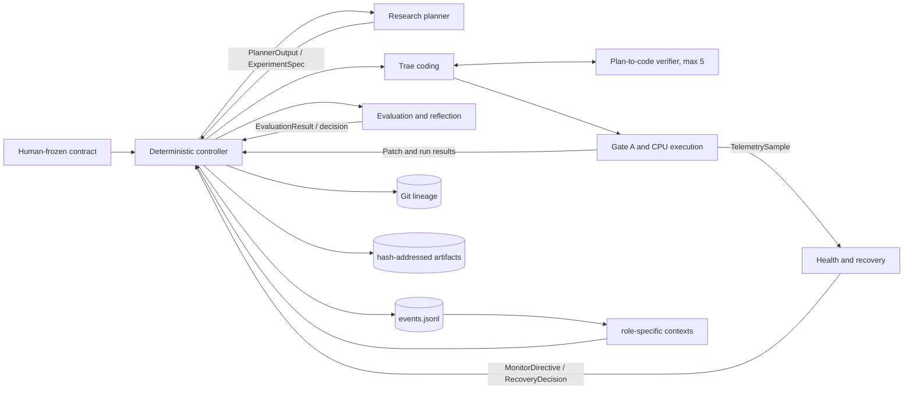

[简体中文](README.zh-CN.md) | **English**

# TacoRank

TacoRank is a deterministic, evidence-tracked harness for autonomous recommender-system research on KuaiRand-Pure. It connects research planning, Trae-based code generation, guarded CPU execution, failure recovery, protected evaluation, durable memory, convergence, and final submission checking in one reproducible workflow.

> **Status:** The complete CPU workflow is implemented. The deterministic suite passes, a bounded production run completed through official submission checking, and a separate live regression run continued correctly into a second research iteration. See [Validation status](#validation-status) for the exact evidence boundary and [Current limitations](#current-limitations) before running it.

## Contents

- [Features](#features)
- [Quick start](#quick-start)
- [Agent-assisted operation](#agent-assisted-operation)
- [Architecture](#architecture)
- [Requirements](#requirements)
- [Installation](#installation)
- [Configuration and end-to-end run](#configuration-and-end-to-end-run)
- [Trae-only coding validation](#trae-only-coding-validation)
- [Run operations](#run-operations)
- [Dataset and evaluation contract](#dataset-and-evaluation-contract)
- [Repository layout](#repository-layout)
- [Team ownership](#team-ownership)
- [Testing](#testing)
- [Validation status](#validation-status)
- [Safety and reproducibility](#safety-and-reproducibility)
- [Contributing](#contributing)
- [Troubleshooting](#troubleshooting)
- [Current limitations](#current-limitations)
- [Documentation](#documentation)
- [License](#license)

## Features

- A complete researcher → Trae coding ↔ bounded implementation verifier → Gate A → CPU execution → Gate B → evaluation → reflection loop.
- A deterministic controller that alone owns workflow state, budgets, recovery, convergence, promotion, rollback, and final selection.
- Production adapters for DeepSeek research planning, the pinned Trae coding worker, and a strict plan-to-code verifier, with isolated test doubles restricted to tests.
- Disposable Git worktrees, protected-path enforcement, symbolic execution commands, Docker isolation, resource limits, and typed recovery decisions.
- An append-only, hash-chained event ledger with replayable state, immutable evidence artifacts, and reproducible derived reports.
- KuaiRand-Pure evaluation fidelity: within-user ranking on `long_view`, protected GAUC and nDCG@5, label-free test inference, and official submission checking.

## Quick start

After completing [installation](#installation) and [deployment setup](#configuration-and-end-to-end-run), start the full autonomous workflow from the repository root with:

```bash
.venv/bin/tacorank run \
  --config .tacorank/deployment/run-config.json \
  --live-config .tacorank/deployment/live-adapters.json
```

This is the canonical end-to-end entry point. It runs one experiment at a time, rebuilds each planner context from durable memory, stops on a frozen convergence or resource rule, and finalizes the selected test submission automatically.

## Agent-assisted operation

[`AGENTS.md`](AGENTS.md) is the operational runbook for coding agents. It explains the system authorities and safety boundaries, development and Trae-only validation, complete live setup, monitoring, recovery, finalization, ledger validation, output inspection, and the evidence an agent must report.

You can give a repository-aware coding agent this instruction:

> Read `AGENTS.md` completely, inspect the current repository state, and help me set up and run the TacoRank workflow. Follow the documented credential and data boundaries, validate each stage with direct evidence, and do not claim completion until the requested completion contract is met.

The guide separates three evidence levels: deterministic development tests, real Trae-only coding validation, and a complete live autonomous ML run. Tell the agent which level you want before it starts provider calls, downloads, Docker builds, or long CPU execution.

## Architecture



TacoRank has three independent authorities:

- human-frozen rules in `contract/COMPETITION.md` and `PROTECTED_PATHS.md`;
- dynamic evidence in `runs/<run_id>/events.jsonl`; and
- exact code lineage in Git.

Only the controller may append events or change workflow state. Role components return typed values and cannot promote candidates, change budgets, access protected labels, or override evaluator truth. Generated state, reports, lessons, and experiment graphs are replayable views rather than additional sources of truth.

## Requirements

| Dependency | Requirement | Purpose |
| --- | --- | --- |
| Git | Submodule and worktree support | Starter-kit pinning and isolated candidate branches |
| Python | 3.9 or newer | TacoRank CLI and control plane |
| Python | 3.12.x | Isolated pinned Trae runtime created by setup |
| Docker | Running Docker-compatible daemon | Hardened Trae tools and CPU candidate execution |
| DeepSeek | `DEEPSEEK_API_KEY` with model access | Research planning, Trae coding, and bounded implementation review |
| KuaiRand-Pure | Local official data, or network access for setup download | Training, evaluation, and submission generation |

The live workflow is CPU-only. On macOS, Docker Desktop or a Docker-compatible daemon such as Colima is sufficient. Native Windows PowerShell is also supported with Docker Desktop in Linux-container mode. Trae tool calls use the same reviewed stateless Docker-exec bridge on Windows, macOS, and Linux; they do not depend on a host pseudo-terminal or `pexpect.spawn`.

## Installation

Clone the repository with its official starter-kit submodule, create a virtual environment, and install the reviewed dependencies:

```bash
git clone --recurse-submodules https://github.com/JellyPenguinnn/tacorank.git
cd tacorank
python3 -m venv .venv
.venv/bin/python -m pip install --upgrade pip
.venv/bin/python -m pip install -r requirements-dev.txt
.venv/bin/python -m pip install --no-deps -e .
.venv/bin/tacorank --help
```

Both the superproject and starter-kit submodule require repository access. Use authenticated HTTPS or your approved SSH configuration; never place a token in a remote URL. If the repository was cloned without submodules, initialize them with:

```bash
git submodule update --init --recursive
```

## Configuration and end-to-end run

Setup must run from a clean tracked checkout so the Git baseline, protected manifest, data views, Docker image, and generated configurations all describe the same commit. Give every independent run a unique identifier.

1. Export the credential in the shell. Never store it in a repository file.

   ```bash
   export DEEPSEEK_API_KEY='your-key'
   ```

2. Prepare the official data, baseline, pinned Trae runtime, Docker image, protected views, and hash-bound configuration.

   ```bash
   .venv/bin/tacorank setup-live \
     --run-id run_001 \
     --download-data
   ```

   If the official data already exists, omit `--download-data` and pass an absolute, non-symlinked path inside this checkout, such as `--data-dir /absolute/path/to/tacorank/KuaiRand-Pure/data`. If Python 3.12 or Docker is not on `PATH`, pass their canonical executables with `--python312` and `--docker`.

3. Run the non-mutating production preflight.

   ```bash
   .venv/bin/tacorank preflight \
     --config .tacorank/deployment/run-config.json \
     --live-config .tacorank/deployment/live-adapters.json
   ```

   Setup places the hash-verified official FM predictions beside every candidate score view and records an executable parity receipt. Preflight verifies the current `solution/candidate.py` still reproduces those exact bytes on smoke, proxy, full, and final routes, in addition to the clean Git baseline and submodule, frozen contracts, data manifest, official evaluator, Trae installation and model access, Docker runtime, read-only edit-tool mount, execution environment, and hard output quota. Success reports `"ledger_created": false`.

4. Start the complete autonomous loop.

   ```bash
   .venv/bin/tacorank run \
     --config .tacorank/deployment/run-config.json \
     --live-config .tacorank/deployment/live-adapters.json
   ```

`setup-live` writes credential-free generated files under ignored `.tacorank/`. The API key is passed only through the environment to the research provider and the isolated Trae child process; it is not written to configuration, prompts, logs, trajectories, fixtures, or artifacts.

## Trae-only coding validation

The production coding path can be validated before downloading data or running ML training. Docker is still required because Trae edit tools run inside the same hardened boundary used by the complete workflow.

```bash
.venv/bin/tacorank setup-trae
.venv/bin/tacorank trae-preflight \
  --config .tacorank/trae/trae-deployment.json \
  --local-only

export DEEPSEEK_API_KEY='your-key'
.venv/bin/tacorank trae-preflight \
  --config .tacorank/trae/trae-deployment.json
.venv/bin/tacorank trae-run-example \
  --config .tacorank/trae/trae-deployment.json \
  --input examples/trae/experiment-spec.json
```

The local-only preflight checks the pinned Trae runtime and Docker tool boundary without reading a credential. The live preflight authenticates to DeepSeek and verifies `deepseek-v4-flash` access with high reasoning. The example creates a real patch in a disposable worktree, checks it against the exact ExperimentSpec through at most five bounded plan-to-code review/revision passes, and applies Gate A, then deliberately stops before dataset access, training, evaluation, or ledger creation.

## Run operations

Use the same frozen deployment configurations for lifecycle operations:

```bash
# Continue only from a durable planning checkpoint.
.venv/bin/tacorank resume \
  --config .tacorank/deployment/run-config.json \
  --live-config .tacorank/deployment/live-adapters.json

# Inspect and verify durable state.
.venv/bin/tacorank status --run-id run_001 --repository-root .
.venv/bin/tacorank validate-ledger --run-id run_001 --repository-root .
.venv/bin/tacorank rebuild-views --run-id run_001 --repository-root .

# Finalize a stopped run if automatic finalization did not complete.
.venv/bin/tacorank finalize \
  --config .tacorank/deployment/run-config.json \
  --live-config .tacorank/deployment/live-adapters.json
```

`resume` repairs only an incomplete final JSONL fragment, validates the frozen run identity, and continues from an unambiguous `planning` or `planner_context` checkpoint. It fails closed during an ambiguous mid-adapter phase. `finalize` is idempotent for an already finalized run.

Each run writes the following ignored evidence tree:

```text
runs/<run_id>/
  events.jsonl                 authoritative append-only evidence
  state.json                   replayable state projection
  STATUS.md                    human-readable status
  contexts/                    immutable role contexts
  lessons/                     lesson and index projections
  experiment-graph/            graph and direction views
  artifacts/                   immutable attempt evidence
  reports/                     summary and resource projections
```

## Dataset and evaluation contract

Starter resources are tracked in `KuaiRand-Pure/` and in the pinned `kuairand-starter-kit` submodule. Downloaded data is intentionally excluded from Git.

Evaluation is within-user ranking over logged KuaiRand-Pure impressions using the native binary `long_view` target. The primary score is the mean of GAUC and nDCG@5. Candidate code cannot modify or read the protected evaluator, split identities, evaluation/test labels, or submission ordering. The only baseline evidence exposed to it is the hash-verified per-row FM prediction for its current score view. Test inference is label-free and cannot feed back into search.

The executable research parent is the setup-verified official FM prediction, not a weaker popularity approximation. The baseline candidate copies it exactly; approved research patches should normally learn a bounded train-only residual on top. Protected evaluation records label-free diagnostics for rankability, item personalization, residual scale, and correlation with the FM parent, so the next planner can distinguish weak implementation mechanics from an unpromising hypothesis without seeing labels.

See [`docs/KUAIRAND_STARTER_KIT.md`](docs/KUAIRAND_STARTER_KIT.md) for data preparation, official splits, baseline reproduction, evaluation semantics, and submission checks.

## Repository layout

```text
src/tacorank/
  agents/            research planner adapter
  providers/         production model clients and provider contracts
  research/          search policy, experiment graph, and method portfolio
  memory/            append-only event store and replay
  context/           bounded role-specific context construction
  orchestrator/      deterministic state machine and adapter routing
  coding/            pinned Trae adapter, semantic verifier, prompts, and redaction
  git/               experiment refs, patches, and disposable worktrees
  safety/            protected manifests, Gate A, and Gate B
  execution/         symbolic commands, Docker runner, and telemetry
  sre/               live health observation
  recovery/          classification and bounded recovery policy
  evaluation/        protected metrics, trust, and decisions
  reflection/        evidence-linked research lessons
  reporting/         reproducible derived views
benchmarks/           KuaiRand-specific adapters
solution/             only candidate area intended for coding-agent edits
research/methods/     reviewed experiment method cards
tests/                unit, integration, and failure-injection coverage
contract/             human-frozen competition contract
runs/                 ignored per-run evidence and reports
artifacts/            ignored shared artifact root
kuairand-starter-kit/ official starter-kit Git submodule
```

## Team ownership

| Role | Responsibility | Main paths |
| --- | --- | --- |
| Person 1 | Evidence-grounded planning and deterministic search policy | `agents/`, `providers/`, `research/` |
| Person 2 | Schemas, ledger, contexts, orchestration, budgets, replay, and CLI | `schemas.py`, `memory/`, `context/`, `orchestrator/`, `cli.py` |
| Person 3 | Trae, Git worktrees, Gate A, execution, telemetry, artifacts, and Gate B | `coding/`, `git/`, `safety/`, `execution/` |
| Person 4 | Health monitoring, failure classification, and bounded recovery | `sre/`, `recovery/` |
| Person 5 | Protected evaluation, trust, final selection, and reflection | `evaluation/`, `reflection/`, `reporting/`, `benchmarks/` |

Only Person 2's controller appends events. Other components own their domain logic and communicate through canonical models in `src/tacorank/schemas.py`.

## Testing

Run the complete deterministic suite before integration:

```bash
PYTHONPATH=src:. PYTHONPYCACHEPREFIX=/tmp/tacorank-pycache \
  .venv/bin/python -m pytest -q
```

Useful component-level checks:

```bash
# Research, schemas, memory, contexts, and orchestration
PYTHONPATH=src:. .venv/bin/python -m pytest \
  tests/research tests/schemas tests/memory tests/context tests/orchestrator

# Coding, Git, gates, execution, and failure injection
PYTHONPATH=src:. .venv/bin/python -m pytest \
  tests/coding tests/git tests/safety tests/execution tests/failure_injection

# Health and recovery
PYTHONPATH=src:. .venv/bin/python -m pytest \
  tests/sre tests/recovery tests/integration/test_recovery_lifecycle.py

# Evaluation, reflection, and reporting
PYTHONPATH=src:. .venv/bin/python -m pytest \
  tests/evaluation tests/reflection tests/reporting
```

Deterministic tests do not substitute for a live provider, Docker, data, or elapsed multi-iteration acceptance run. Keep those evidence classes separate when reporting results.

## Validation status

As of 2026-08-30:

- The current complete automated suite passes 549 tests, with 11 expected platform skips.
- A bounded live CPU run used the production DeepSeek researcher, pinned Trae worker, hardened Docker runner, and official KuaiRand-Pure data.
- Trae produced a pairwise BPR candidate that changed only `solution/candidate.py`; all 14 Gate A checks and all 11 Gate B checks passed for both smoke and proxy execution.
- Protected proxy evaluation scored GAUC `0.62112551`, nDCG@5 `0.51277198`, and primary `0.56694875`, so the controller correctly pruned the candidate.
- The one-experiment budget selected the still-best official FM baseline and produced a manifest-attested 170,588-row test submission accepted by both TacoRank and the official checker. The 20-event ledger replayed successfully.
- A separate live iterative regression run completed its first real coding, Gate A, CPU smoke/proxy, Gate B, protected evaluation, and prune cycle, then durably created and proposed `exp_002` and entered its new Trae coding context. It was intentionally stopped during that second coding pass after the continuation behavior was observed.
- Post-run forensics found that the editable popularity parent scored `0.580721929` while the separately evaluated official FM scored `0.601468756`. The repaired candidate now reproduces the official FM bytes exactly; a full 124,909-row CPU replay returned GAUC `0.6671326322`, nDCG@5 `0.5358048805`, and primary `0.6014687564`.
- The `exp_006` malformed DeepSeek tool-argument path is covered by an executable compatibility-patch test plus integration with Waihong's bounded self-recovery policy. The worker retains redacted evidence and exact provider-token/wall-time accounting; malformed arguments are corrected inside Trae first, while any remaining adapter failure follows the policy's classified same-commit retry, abandon, or stop decision. A new live provider run still requires a fresh clean deployment and is not implied by these deterministic checks.
- Deterministic regression coverage now also exercises the five-review plan-to-code boundary, verifier JSON repair, Trae revision/exhaustion behavior, cumulative token/artifact accounting, ExperimentSpec target-file enforcement, and the isolated Gate A entrypoint import. These checks do not retroactively claim that the historical paid run used the new verifier.

This proves a real integrated baseline path, live cross-iteration continuation, and current executable FM parity—not elapsed live convergence or a winning candidate. The bounded acceptance could not exercise three non-improving full iterations, and the candidate-best clean-reproduction path was not entered because the candidate failed proxy. Deterministic integration tests cover those control paths. Full historical evidence and scope are recorded in [`docs/person3-handoff.md`](docs/person3-handoff.md).

## Safety and reproducibility

- Gate A binds an accepted patch to its commit, diff, contract, protected manifest, and data identities before execution.
- Before Gate A, a strict DeepSeek verifier checks that the changed code materially implements the approved ExperimentSpec. It runs at most five reviews (the initial solution plus at most four bounded Trae revisions); it cannot inspect metrics, accept execution safety, or replace Gate A.
- Gate A rejects cumulative changes outside `ExperimentSpec.target_files` and imports `solution.candidate:run` inside a read-only, network-disabled Docker boundary before issuing a receipt.
- The runner resolves reviewed symbolic commands and never accepts raw LLM shell commands.
- Candidate code runs in disposable worktrees and CPU Docker containers with bounded resources and output quotas.
- Gate B validates prediction structure, row identity, finiteness, and producer lineage before evaluation.
- Expected failures produce typed, redacted, hash-addressed evidence; repair and same-commit retries are bounded.
- Recovery retries only the owning stage on immutable input. Verified candidate defects receive a grounded Trae repair prompt; malformed agent protocol, infrastructure, quota, and controller failures are not misrepresented as code defects. A candidate-scoped integrity rejection receives one clean Trae restart from the declared trusted parent, never an edit to the rejected candidate or a safety gate.
- Every semantic solver pass records its diff hash, redacted Trae trajectory/process log, verifier findings, provider calls, tokens, and elapsed action time in attempt-local artifacts.
- Malformed or truncated DeepSeek tool arguments are converted into an in-loop Trae correction step. If Trae still exits unsuccessfully, its redacted process log, trajectory when available, exact provider-token accounting, and wall time are ledgered; the same frozen coding assignment receives one clean retry before only that experiment is abandoned.
- Candidate-scoped integrity violations remain in the ledger, discard the rejected candidate, and receive at most one clean restart from the trusted parent. Credential findings, protected identity/control-plane mismatches, and repeated integrity violations remain fail-closed; only those system-scoped cases terminate the run as `fatal_integrity`.
- Convergence counts terminal trusted full-fidelity research iterations, not confirmation-seed executions.
- Finalization selects only the validation best, requires clean reproduction for a candidate, and keeps test identities out of planning and evaluation feedback.
- Datasets, credentials, `.tacorank/`, submissions, environments, run ledgers, and generated artifacts are ignored and must never be committed.

## Contributing

Read [`AGENTS.md`](AGENTS.md) before making changes. In particular:

1. Keep behavior in its owning subsystem and use shared models from `src/tacorank/schemas.py`.
2. Preserve evaluator, split, prompt, seed, metric, protected-path, and ledger-history boundaries.
3. Update fixtures and cross-component tests whenever a shared schema or handoff changes.
4. Run the narrowest relevant tests, then the complete suite before integration review.
5. Keep data, secrets, submissions, generated evidence, and unrelated local changes out of commits.
6. In pull requests, document affected subsystems, commands run, data and split assumptions, seeds, metric changes, and residual limitations.

## Troubleshooting

If Python 3.12 or Docker is not on `PATH`, pass canonical executables with `--python312` and `--docker`. If the data is already present, omit `--download-data` and use `--data-dir` when needed. Setup requires a clean tracked checkout because the generated Docker image, Git baseline, contract, and protected manifest must all describe the same commit. The generated files are hash-bound to that exact `HEAD`; after committing source changes, generate a new deployment (or remove only the old generated deployment/runtime directories) before running preflight again.

### Windows PowerShell

Run PowerShell from the repository root. Docker Desktop must be running with
Linux containers enabled (the WSL2 backend is recommended). WSL integration is
needed only when running these commands from a WSL shell. The explicit
executable paths avoid PowerShell/PATH ambiguity:

```powershell
cd C:\nus\techjam\tacorank

git submodule update --init --recursive

if (-not (Test-Path .venv\Scripts\python.exe)) {
    py -3.12 -m venv .venv
}
.\.venv\Scripts\python.exe -m pip install -r requirements-dev.txt
.\.venv\Scripts\python.exe -m pip install --no-deps -e .

$env:DEEPSEEK_API_KEY = "your-key"
$python312 = (py -3.12 -c "import sys; print(sys.executable)").Trim()
$docker = (Get-Command docker.exe -ErrorAction Stop).Path

# Keep --download-data for the first setup (or when KuaiRand-Pure/data is incomplete).
.\.venv\Scripts\tacorank.exe setup-live `
    --download-data `
    --python312 $python312 `
    --docker $docker

.\.venv\Scripts\tacorank.exe preflight `
    --config .tacorank\deployment\run-config.json `
    --live-config .tacorank\deployment\live-adapters.json

.\.venv\Scripts\tacorank.exe run `
    --config .tacorank\deployment\run-config.json `
    --live-config .tacorank\deployment\live-adapters.json
```

The backtick is PowerShell's line-continuation character. Do not type the
backslash before it. Omit `--download-data` when the data is already complete.
Run `setup-live` only once for a deployment directory; if one already exists,
choose new `--deployment-dir` and `--runtime-dir` values. Each setup creates a
new hash-bound deployment. Native Windows uses Docker
Desktop's local `npipe://` endpoint; keep Docker Desktop in Linux-container
mode (the WSL2 backend is recommended). Newly generated deployments patch the
pinned Trae runtime to use bounded stateless Docker exec, translate host paths
to POSIX container paths, and verify both the patch and the container `timeout`
command during preflight. Deployments generated before this compatibility patch
must not be reused; create a new deployment and run ID.

For a reproducible end-to-end run, the repository also includes
`run-new-live.ps1`. It creates a unique deployment/runtime/run identity, so it
does not collide with an earlier attempt. From the repository root, export the
key in the same PowerShell session and run:

```powershell
$env:DEEPSEEK_API_KEY = "your-key"
Set-ExecutionPolicy -Scope Process -ExecutionPolicy Bypass
.\run-new-live.ps1 -DownloadData
```

Omit `-DownloadData` only when the required files are already present under
`KuaiRand-Pure\data`. The script fails before setup if the tracked checkout or
starter-kit submodule is dirty, Docker is unavailable, Python 3.12 cannot be
found, or the API-key variable is missing. It prints the final status and runs
`validate-ledger` before reporting success; it never prints the key.

### macOS

Run from a clean checkout with Docker Desktop running:

```bash
cd /path/to/tacorank
git submodule update --init --recursive

python3.12 -m venv .venv
.venv/bin/python -m pip install -r requirements-dev.txt
.venv/bin/python -m pip install --no-deps -e .

export DEEPSEEK_API_KEY='your-key'
PYTHON312="$(command -v python3.12)"
DOCKER="$(command -v docker)"

# Include --download-data only when KuaiRand-Pure/data is not already complete.
.venv/bin/tacorank setup-live --download-data \
  --python312 "$PYTHON312" \
  --docker "$DOCKER"

.venv/bin/tacorank preflight \
  --config .tacorank/deployment/run-config.json \
  --live-config .tacorank/deployment/live-adapters.json

.venv/bin/tacorank run \
  --config .tacorank/deployment/run-config.json \
  --live-config .tacorank/deployment/live-adapters.json
```

On Apple Silicon, Docker Desktop should use its default Linux/ARM64 engine;
the pinned runtime image must be available for the selected Docker
architecture. If the data directory is already complete, omit
`--download-data`. Do not run `setup-live` twice against the same deployment
directory. macOS uses Docker Desktop's local Unix socket and the same stateless
Docker-exec bridge as Windows, without changing its existing socket behavior.

Preflight is deliberately non-mutating with respect to run state. It verifies the clean baseline and exact submodule, frozen contract and protected paths, every data-manifest file, official evaluator and FM baseline, pinned Trae install/config/runtime, credential presence and DeepSeek model access, Docker daemon/image/environment, execution of the manifest-verified Trae edit tool through its read-only container mount, and the Docker tmpfs hard-output quota. A successful result reports `"ledger_created": false`.

After a run starts, inspect or rebuild its state with:

```bash
tacorank resume --run-id run_001 --repository-root .
tacorank status --run-id run_001 --repository-root .
tacorank validate-ledger --run-id run_001 --repository-root .
tacorank rebuild-views --run-id run_001 --repository-root .
tacorank finalize --run-id run_001 --repository-root .
```

Production never falls back to fake adapters. Deterministic fakes remain behind the explicit test-only flag. The production command is intentionally quiet while work is running and prints a final JSON status; inspect `runs/<run-id>/STATUS.md`, `SUMMARY.md`, and `events.jsonl` for the recorded outcome. `resume` currently validates/repairs the ledger tail and reports the recovery phase without restarting adapter execution. `finalize` still refuses to fabricate success because standalone clean reproduction/final selection is not implemented yet.

## Core guarantees

- All role boundaries use the canonical models in `src/tacorank/schemas.py`.
- Only the deterministic harness writes the event ledger or owns budgets, routing, convergence and final selection.
- Candidate execution requires an exact Gate A receipt bound to the commit, diff, contract and data identities.
- The runner resolves reviewed symbolic commands; it does not accept raw LLM shell commands.
- Candidate code cannot access protected evaluator labels or iterative hidden-final feedback.
- Person 3 owns termination mechanics; Person 4 returns typed health and recovery decisions.
- Gate B validates prediction structure and producer identity before Person 5 evaluation.
- Expected failures return typed results with redacted, hash-addressed evidence.
- Repair attempts and same-commit retries are bounded to prevent recovery loops.

## Collaboration rules

1. Import shared models from `src/tacorank/schemas.py`; do not create component-local replacements.
2. Preserve role ownership and communicate through typed adapter interfaces.
3. Never modify frozen contracts, protected paths, evaluator logic, data splits, or event history from candidate code.
4. Update affected fixtures and cross-component tests with every shared-schema change.
5. Keep datasets, credentials, submissions, model artifacts, sensitive run ledgers and local environments out of Git.
6. Run the complete test suite before requesting integration review.

| Symptom | Resolution |
| --- | --- |
| `setup-live` reports a dirty checkout | Preserve or commit intended tracked changes, then rerun setup from the exact clean commit that should anchor the experiment. |
| Python 3.12 or Docker cannot be found | Pass absolute executable paths with `setup-live --python312 ... --docker ...`. |
| Docker preflight cannot reach the daemon | Start Docker Desktop or the configured compatible daemon, then rerun `preflight`. |
| Trae reports `pexpect` has no `spawn` | The deployment predates the cross-platform Docker bridge. Preserve its evidence, update TacoRank, and create a fresh `setup-live` deployment and run ID. |
| Trae exits with a Windows `UnicodeEncodeError` for a status glyph | Update TacoRank to a revision that forces UTF-8 for the isolated Trae subprocess, commit the tracked change, and create a fresh deployment and run ID. Do not reuse the finalized or hash-bound deployment. |
| Gate A reports many protected paths changed although Git and `changed_file_match` are clean | Preserve the run evidence and update TacoRank. Protected manifests canonicalize tracked non-binary CRLF/LF checkout variants across Windows, macOS, and Linux while continuing to reject genuine text or binary tampering. Create a fresh deployment from the fixed commit. |
| DeepSeek authentication or model preflight fails | Export a valid `DEEPSEEK_API_KEY` in the current shell; never place it in a tracked file. |
| The run identifier already has a ledger | Choose a new `--run-id` in `setup-live`; completed ledgers are immutable and are not reused for new runs. |
| `resume` rejects the current phase | The last durable state is mid-adapter and ambiguous. Preserve the ledger and evidence for operator review instead of fabricating a result. |

## Current limitations

- Candidate execution is CPU-only; GPU commands fail closed until a hard per-container GPU-memory limit is available.
- Automatic resume is supported only at durable planning checkpoints. A crash during a provider, coding, execution, or protected-evaluation call requires operator review at the last unambiguous boundary.
- Live success depends on the current machine, credential, provider, Docker daemon, network, and official data. Passing deterministic tests alone does not prove those external dependencies are available.
- Semantic verification is an implementation-alignment check, not evidence that a research idea will improve protected metrics; smoke, proxy, full execution, Gate B, and protected evaluation remain authoritative.
- The finalized live acceptance was intentionally bounded to one experiment. A later live run proved transition into a second iteration but was intentionally stopped there; neither is evidence of elapsed three-iteration convergence.

## Documentation

- [`docs/HARNESS.md`](docs/HARNESS.md) — control plane, event flow, finalization, and schema-change procedure
- [`docs/person3-handoff.md`](docs/person3-handoff.md) — Trae, Git, gate, execution, and live acceptance evidence
- [`docs/research/planning-and-search.md`](docs/research/planning-and-search.md) — planning and search boundary
- [`docs/KUAIRAND_STARTER_KIT.md`](docs/KUAIRAND_STARTER_KIT.md) — dataset, baseline, evaluation, and submission details
- [`TacoRank-Memory-Schema-v1.md`](TacoRank-Memory-Schema-v1.md) — event and memory schema reference
- [`research/CURRENT_RUN_IMPROVEMENT_PLAN.md`](research/CURRENT_RUN_IMPROVEMENT_PLAN.md) — reviewed initial research directions

## License

A repository-wide license has not yet been declared. Do not assume permission to redistribute TacoRank code. The bundled KuaiRand-Pure resources retain their upstream terms; see [`KuaiRand-Pure/LICENSE`](KuaiRand-Pure/LICENSE) and the pinned starter-kit submodule.
