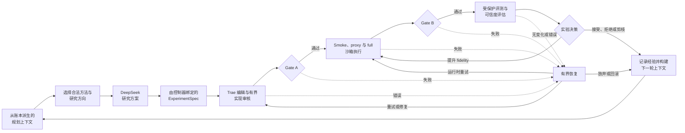
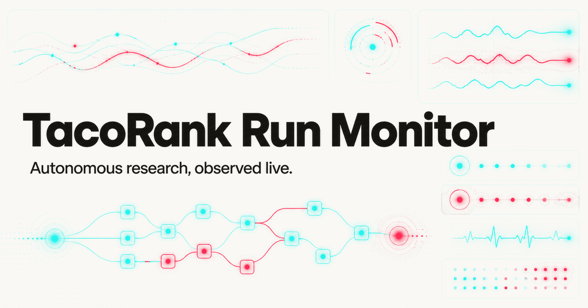

**简体中文** | [English](README.md)

# TacoRank

TacoRank 是一个面向 KuaiRand-Pure 基准的确定性、事件溯源式自动推荐系统研究框架。它把研究规划、方法卡检索、基于 Trae 的代码生成、受控执行、故障恢复、受保护评测、反思、收敛判断和最终提交检查连接成一个完整工作流。

本项目同时尝试回答两个问题：

1. 自动化智能体能否发现并实现有价值的推荐系统改进？
2. 每一项决策、指标、故障、恢复操作、资源成本和最终制品能否被复现和审计？

TacoRank 是控制平面系统，而不是一个独立的推荐模型。候选模型代码位于 `solution/`，控制平面负责实验生命周期和冻结的竞赛约定。

## 目录

- [项目概览](#项目概览)
- [TacoRank 的差异](#tacorank-的差异)
- [研究方法](#研究方法)
- [当前架构](#当前架构)
- [运行要求](#运行要求)
- [配置与安装](#配置与安装)
- [复现与验证结果](#复现与验证结果)
- [监控与 Dashboard](#监控与-dashboard)
- [仓库结构](#仓库结构)
- [团队成员贡献](#团队成员贡献)
- [集成约定](#集成约定)
- [限制与未来改进](#限制与未来改进)
- [故障排查](#故障排查)
- [开发与贡献规则](#开发与贡献规则)
- [文档](#文档)
- [许可证](#许可证)

## 项目概览

完整工作流如下：

    冻结约定与经过验证的官方 FM 基线
        -> 从账本派生的规划上下文
        -> 确定性选择一个合法且已审核的方法卡
        -> 来自哈希绑定论文库的有界参考资料
        -> 不读取代码的 DeepSeek ResearchProposal
        -> 由控制器绑定实现细节的 ExperimentSpec
        -> Trae 在一次性 Git worktree 中编辑
        -> 方案到代码审核与有界修订
        -> Gate A 补丁与代码谱系验证
        -> CPU smoke、proxy 和 full 执行
        -> 遥测、Gate B 验证与有界恢复
        -> 受保护评测与反思
        -> 下一个实验或确定性停止
        -> 干净复现验证集最优候选，或使用受保护 FM fallback
        -> 无标签最终推理、最终 Gate B 与官方提交检查

### 单次实验的生命周期

控制器是确定性的，也是唯一可以修改工作流状态或追加事件账本的组件。外部智能体只返回类型化记录；它们不能选择最终检查点、修改预算、绕过 gate、访问隐藏标签或改写评测器。

### 已观察结果与证据边界

已完成的参考运行使用生产工作流一直执行到官方提交检查：

| 项目 | 已观察结果 |
| --- | ---: |
| 提出的实验数 | 6 |
| 最强研究候选 | `exp_006`，primary 为 0.6022983341 |
| 受保护 FM 基线 | primary 为 0.6014687564 |
| 最终合格选择 | `baseline` |
| 停止原因 | `no_legal_proposal` |
| 提交检查 | accepted |

虽然 `exp_006` 的点估计更高，但其增益被判定为处于噪声范围内，因此控制器保留了受保护 FM 基线。这证明完整工作流和 fail-closed 选择约定成功运行，但不能证明自动化研究改善了基准成绩。下文介绍的因果滚动反馈方向是在该参考运行之后加入研究组合的，并未在此次运行中得到评测。

## TacoRank 的差异

- **将智能能力与决策权限分离。** DeepSeek 和 Trae 可以提出研究与代码，但确定性控制器掌握预算、路由、晋级、恢复、停止、最终选择和账本写入权限。
- **每个候选都必须通过两个独立 gate。** Gate A 验证补丁是否合法且可以执行；Gate B 验证预测制品是否具备受保护评测或提交资格。
- **实验历史是证据，而不是可随意修改的应用状态。** 方案、补丁、gate 回执、执行结果、指标、恢复决策和资源使用会追加到哈希链账本，再重放为便于阅读的视图。
- **失败也是有效结果。** 控制器可以重试、放弃、回滚或选择受保护 FM fallback，但智能体不能削弱检查，也不能在缺少可信证据时晋级一个看似亮眼的分数。

## 研究方法

官方 FM 基线是一个强大的静态二阶模型，但它无法直接表示不断变化的用户意图、严格的过去行为历史、候选列表上下文，或不同排序目标之间的互补误差。因此，TacoRank 会在已审核组合中搜索 pairwise 与 listwise 目标、紧凑排序器、因果历史、辅助互动信号、时长偏差修正、时间漂移特征和 ensemble 方法。

最新的集成候选方向是一个受资格条件约束的因果滚动反馈残差融合：

1. **构建无泄漏历史。** 用户、用户-视频、用户-作者、session、item、时间间隔和获准互动特征只能使用严格早于当前评分行的数据，并采用确定性的同时间戳策略。
2. **训练多样化紧凑排序器。** 小型 LambdaRank、`rank_xendcg` 和 CatBoost YetiRank 成员使用不同归纳偏置优化用户内排序，同时保持在 CPU 预算内。
3. **修正互补残差误差。** Frozen-history LightGBM、第二个排序器和紧凑的序列/时间上下文成员通过以下冻结稀疏配方贡献按用户归一化的修正向量：

       Z(lab_base) - 0.40*Z(frozen_lgb) - 0.10*Z(rank2) + 0.15*Z(DIN50)

4. **保留可信 fallback。** Setup 验证的 FM 分数继续用于未见情况和最终 fallback；系数、seed、归一化、cutoff 规则和成员 identity 都会在受保护评测前冻结，而不会针对每个验证 slice 调参。
5. **拒绝薄弱或不安全证据。** 未来/自身结果泄漏、顺序不明确、后期时间段回退、增益过度集中，或没有超过 `epsilon` 的可信 full-fidelity 改进，都会证伪该方法。

只有当 serving 约定明确允许在评分时使用更早行的反馈，该方向才具备选择资格；否则控制器必须选择仅使用训练窗口的因果历史方法。其精确前置条件、允许数据、实现边界和证伪规则详见 [`ensemble_causal_rolling_residual_blend` 方法卡](research/methods/ensemble_causal_rolling_residual_blend.md)，更完整的方法组合位于 [`research/methods/`](research/methods/)。

## 当前架构

实现位于 `src/tacorank` 命名空间中。主要组件如下：

| 组件 | 职责 | 主要路径 |
| --- | --- | --- |
| 研究规划器 | 选择合法的研究类别和方法卡、验证方案，并应用搜索与收敛策略。 | `src/tacorank/agents`、`src/tacorank/providers`、`src/tacorank/research`、`research/methods` |
| 上下文与约定 | 构建有界、按角色划分的上下文，并验证共享交接 schema。 | `src/tacorank/context`、`src/tacorank/schemas.py` |
| 编排器 | 运行状态机、管理预算、路由适配器并追加事件。 | `src/tacorank/orchestrator` |
| 事件记忆 | 保存仅追加、哈希链保护的账本及可重放投影。 | `src/tacorank/memory`、`runs` |
| Trae 编码 | 在一次性 worktree 中生成补丁、记录 trajectory，并协调有界实现审核。 | `src/tacorank/coding`、`src/tacorank/git` |
| 安全护栏 | 强制执行受保护路径、数据边界、命令策略、Gate A 和 Gate B。 | `src/tacorank/safety`、`PROTECTED_PATHS.md` |
| 执行与 SRE | 在 Docker 中运行已审核的符号化命令，监控健康状态与资源，并记录制品。 | `src/tacorank/execution`、`src/tacorank/sre` |
| 恢复 | 对故障分类，并选择有界修复、重试、回滚或放弃操作。 | `src/tacorank/recovery` |
| 评测与报告 | 计算受保护指标、可信度诊断、经验、资源报告和最终选择证据；最终选择由控制器执行。 | `src/tacorank/evaluation`、`src/tacorank/reflection`、`src/tacorank/reporting` |
| 基准适配器 | 将控制器连接到官方 KuaiRand-Pure 评测器和提交检查器。 | `benchmarks/kuairand_pure`、`kuairand-starter-kit` |
| 候选方案 | 正常情况下唯一允许编码智能体修改的模型区域。 | `solution` |
| Dashboard | 读取仓库中的账本，展示运行、实验、gate、指标、恢复和 token 使用情况。 | `ui` |

集成流程使用 `src/tacorank/schemas.py` 中的标准共享记录：

    ExperimentSpec -> PatchCandidate -> PatchCheckResult
        -> RunResult -> OutputCheckResult -> EvaluationResult
        -> RecoveryDecision 与持久化反思/报告记录

### Gate A 与 Gate B

Gate A 判断拟议代码变更是否安全、合法并可以执行。它检查 diff、目标文件、Git 谱系、约定与受保护路径 identity、语法与 import、接口要求、命令策略、数据与网络边界、凭证扫描、依赖项，以及适用的 smoke 检查。

Gate B 判断生成的预测制品是否有效，并具备评测或提交资格。它检查行数、表头、行 ID、用户/视频对齐、有限分数、重复项保留、分数多样性、制品 identity 和生产者谱系。

补丁通过 Gate A 后仍可能在模型执行阶段失败。成功执行并通过 Gate B 的结果，也可能因为无法稳定改善父节点而被受保护评测拒绝。

### 权限与安全边界

- `contract/COMPETITION.md` 是冻结的基准约定。
- `PROTECTED_PATHS.md` 定义不可修改和禁止访问的路径。
- `runs/<run_id>/events.jsonl` 是动态证据的权威来源。
- Git commit 和 Gate A 回执确立可执行代码谱系。
- 状态文件、报告、经验和实验图都是可重放视图。
- 候选代码只能访问获准数据，并在无网络环境中运行。
- Test 标签和隐藏最终反馈绝不会进入规划、搜索或本地指标反馈。
- 官方评测器和提交检查器受到保护。

## 运行要求

控制平面需要：

- 支持 submodule 与 worktree 的 Git。
- Python 3.9 或更高版本。
- 实时运行需要本地兼容 Docker 的守护进程。

生产 Trae 路径需要：

- 一个规范化的 Python 3.12 可执行文件。
- Docker Desktop 或其他获准的兼容 Docker 运行时。
- 通过 `DEEPSEEK_API_KEY` 环境变量提供的 DeepSeek 访问权限。

执行基准需要：

- 固定版本的 `kuairand-starter-kit` submodule。
- 位于 `KuaiRand-Pure/data` 的官方 KuaiRand-Pure 数据，或在 setup 期间下载数据的授权。

生产候选工作流目前仅使用 CPU。公共资源 schema 仍记录 GPU-hours，以便未来增加执行后端时无需修改证据约定。

## 配置与安装

### 克隆并初始化仓库

    git clone --recurse-submodules https://github.com/JellyPenguinnn/tacorank.git
    cd tacorank
    git submodule update --init --recursive

请使用团队已经配置的 HTTPS 或 SSH 认证方式。不要把 access token 写进 Git URL。

### 安装控制平面

    python3 -m venv .venv
    .venv/bin/python -m pip install --upgrade pip
    .venv/bin/python -m pip install -r requirements-dev.txt
    .venv/bin/python -m pip install --no-deps -e .
    .venv/bin/tacorank --help

创建实时 deployment 前，仓库必须处于干净状态。保留现有修改；请使用新的干净 checkout，或仅在团队明确授权后提交修改。

### 准备实时 deployment

在启动运行的同一个 shell 中导出 provider 凭证。该凭证不会写入仓库文件、配置文件、trajectory 或报告。

    export DEEPSEEK_API_KEY='your-key'

每次独立尝试都要选择新的运行 identity：

    REPO_ROOT="$(pwd -P)"
    RUN_ID="run_001"
    DEPLOYMENT_DIR="$REPO_ROOT/.tacorank/deployments/$RUN_ID"
    RUNTIME_DIR="$(dirname "$REPO_ROOT")/.tacorank-runtime/$(basename "$REPO_ROOT")-$RUN_ID"
    DATA_DIR="$REPO_ROOT/KuaiRand-Pure/data"

如果官方数据已经完整存在，请去掉 `--download-data`。否则，setup 可以下载并验证数据：

    .venv/bin/tacorank setup-live \
      --repository-root "$REPO_ROOT" \
      --deployment-dir "$DEPLOYMENT_DIR" \
      --runtime-dir "$RUNTIME_DIR" \
      --data-dir "$DATA_DIR" \
      --run-id "$RUN_ID" \
      --download-data

如果 `PATH` 中没有 Python 3.12 或 Docker，请通过 `--python312` 和 `--docker` 传入它们的绝对可执行文件路径。Setup 会创建不含凭证、经过哈希绑定的配置、受保护基准视图、基线预测、固定 Trae 环境，以及绑定 digest 的 Docker 镜像。

## 复现与验证结果

“复现结果”可能指以下三种不同任务：

| 目标 | 所需条件 | 能证明什么 |
| --- | --- | --- |
| 验证一次已有运行 | 完整的 `runs/<run_id>/` 证据目录 | 归档账本和报告结果在内部是一致且有效的。 |
| 复现 FM 基线 | 官方 KuaiRand-Pure 数据 | 固定版本的官方基线能够产生报告中的基准指标。 |
| 再次运行 TacoRank | 数据、Docker、Python 3.12 和 DeepSeek 访问权限 | 新的自动化工作流可以在冻结约定下完成。 |

### 路径 A——验证已记录的证据运行

参考运行 ID 为 `run_20260830094907711_3c78fb3c`。运行证据被有意排除在 Git 之外，因此新的 clone **不包含**该账本。若要验证这次历史运行，请先取得完整、未经修改的证据目录，并将其保留在：

    runs/run_20260830094907711_3c78fb3c/

该归档必须与仓库分开发布，例如作为附带公开 SHA-256 的不可变 release asset。在团队发布该制品前，外部读者可以复现官方基线或启动新运行，但无法独立验证这份精确的历史账本。不要将该归档提交到 Git。

然后在仓库根目录运行：

    REPO_ROOT="$(pwd -P)"
    RUN_ID="run_20260830094907711_3c78fb3c"

    test -f "$REPO_ROOT/runs/$RUN_ID/events.jsonl"

    .venv/bin/tacorank status \
      --run-id "$RUN_ID" \
      --repository-root "$REPO_ROOT"

    .venv/bin/tacorank validate-ledger \
      --run-id "$RUN_ID" \
      --repository-root "$REPO_ROOT"

预期的账本验证结果为：

    valid: 135 events, head=825d62ab2f77ac0791d91d47d6d6b98925708eb9eb9a2e96593ddb5a6056430a

状态必须显示 `status=finalized`、`phase=finalized`、停止原因 `no_legal_proposal`、最终实验 `baseline`，并以 `submission.checked` 事件结束。若要从已验证账本重新生成便于阅读的视图，请运行：

    .venv/bin/tacorank rebuild-views \
      --run-id "$RUN_ID" \
      --repository-root "$REPO_ROOT"

随后检查：

    runs/<run_id>/STATUS.md
    runs/<run_id>/reports/SUMMARY.md
    runs/<run_id>/reports/RESOURCES.md
    runs/<run_id>/events.jsonl

记录的结果如下：

| 项目 | 结果 |
| --- | ---: |
| 官方 FM 基线 GAUC | 0.6671326322 |
| 官方 FM 基线 nDCG@5 | 0.5358048805 |
| 官方 FM 基线 primary | 0.6014687564 |
| 最佳研究候选 | `exp_006` |
| 最佳候选 primary | 0.6022983341 |
| 提出的实验数 | 6 |
| 完成的 full 评测数 | 9 |
| 停止原因 | `no_legal_proposal` |
| 最终选择 | `baseline` |
| 提交检查 | accepted |
| Provider tokens | 2,454,526 |
| GPU-hours | 0 |
| 人工干预次数 | 0 |

候选分数被判定为处于噪声范围内，因此受保护 FM 基线仍是验证集上最优的合格选择。这证明完整工作流成功最终化，但不能证明自动化研究改善了基准成绩。

### 路径 B——复现官方 FM 基线

此路径无需调用 DeepSeek 或运行自动化循环，只检查基准数值。将官方数据放在 `KuaiRand-Pure/data/` 后，从仓库根目录运行：

    REPO_ROOT="$(pwd -P)"

    .venv/bin/python kuairand-starter-kit/baseline.py \
      --data_dir "$REPO_ROOT/KuaiRand-Pure/data" \
      --model fm

预期验证指标为 GAUC `0.6671326322`、nDCG@5 `0.5358048805`，两者的 primary 均值为 `0.6014687564`。这只会复现官方 FM 基线，不会复现自动化实验历史或最终提交工作流。

### 路径 C——运行新的完整自动化工作流

首先完成[配置与安装](#配置与安装)，包括上一节的实时 deployment。该 setup 会定义 `REPO_ROOT`、`RUN_ID`、`DEPLOYMENT_DIR` 和 `RUNTIME_DIR`。然后运行：

    RUN_CONFIG="$DEPLOYMENT_DIR/run-config.json"
    LIVE_CONFIG="$DEPLOYMENT_DIR/live-adapters.json"

    .venv/bin/tacorank preflight \
      --config "$RUN_CONFIG" \
      --live-config "$LIVE_CONFIG"

Preflight 必须成功退出并报告：

    {"ledger_created": false, "runtime": "live", "status": "passed"}

只有 preflight 通过后，才能启动会产生费用的实时工作流。保持命令连接，直至它自行返回：

    .venv/bin/tacorank run \
      --config "$RUN_CONFIG" \
      --live-config "$LIVE_CONFIG"

命令返回后，验证新的运行：

    .venv/bin/tacorank status \
      --run-id "$RUN_ID" \
      --repository-root "$REPO_ROOT"

    .venv/bin/tacorank validate-ledger \
      --run-id "$RUN_ID" \
      --repository-root "$REPO_ROOT"

成功的完整运行必须具有 `status=finalized`、`phase=finalized`、已选择的最终实验或受保护基线 fallback、已接受的提交检查，以及有效账本。如果缺少任何一项，请保留运行证据，并将工作流视为尚未完成。

控制器会根据已记录输入作出确定性决策，但 DeepSeek 和 Trae 属于外部模型调用。因此，新运行不保证产生与参考运行相同的方案、补丁、实验数量或最终指标；它会在相同冻结规则下产生一份新的、可审计的结果。

## 监控与 Dashboard

可选 UI 是一个读取本地仓库的 dashboard。它读取运行和事件，而不会成为第二个事实来源；它展示实验方案、父子谱系、Gate A、执行、Gate B、评测、恢复、资源统计和 provider token 使用情况。

启动方式：

    cd ui
    npm install
    npm run dev

验证 UI：

    npm run lint
    npm run build

通过 dashboard 启动运行时，界面会用遮罩输入框获取 provider key。该 key 会传递给本地 launcher，但不会保存在浏览器存储、运行 metadata、launcher 日志或 API 响应中。

## 仓库结构

    src/tacorank/
      agents/          研究规划适配器
      providers/       DeepSeek 与 provider 约定
      research/        方法卡、搜索策略、实验图和收敛判断
      context/         有界 planner、coder 和 recovery 上下文
      schemas.py       标准共享事件与交接 schema
      orchestrator/    确定性状态机与路由
      memory/          事件存储、重放和投影
      coding/          Trae 适配器、prompt、校验器和脱敏
      git/             一次性 worktree、ref 和补丁机制
      safety/          受保护路径、命令策略、Gate A 和 Gate B
      execution/       符号化命令、Docker 执行和遥测
      sre/             心跳、健康状态、异常和资源观察
      recovery/        故障分类与有界恢复策略
      evaluation/      指标、可信度、比较和最终选择
      reflection/      可复用经验与研究反思
      reporting/       结果、资源、图表和实验树
    solution/          候选模型与特征实现区域
    research/methods/  已审核的方法卡
    benchmarks/        KuaiRand 专用评测/提交适配器
    kuairand-starter-kit/
                       固定版本的官方 starter kit submodule
    contract/          人工冻结的竞赛约定
    tests/             单元、集成和故障注入测试
    runs/              被忽略的逐运行账本与证据
    ui/                可选本地运行 dashboard

## 团队成员贡献

本项目并非个人项目。以下职责划分对应实际的 `src/tacorank` 架构，所有成员通过标准 schema 和控制器拥有的事件账本进行集成。

### Person 1——San Chian：规划与实验搜索

研究参考：AIDE、UCB 节点选择和 AIDE ML 仓库。

职责：

- 定义假设、研究类别、方法卡策略和父子搜索行为。目标文件和执行 fidelity 仍由控制器绑定。
- 基于控制器记录的谱系设计搜索，并允许策略批准后从有前景的历史节点继续分支。
- 实现 UCB 风格的探索/利用决策。
- 生成特征、模型、loss、训练策略、超参数和 ensemble 实验方案。
- 定义由控制器评估和执行的 proxy 晋级、剪枝和收敛条件。
- 解释并记录选择每个节点的原因。
- 为 dashboard 提供实验树视图。

实际负责路径：

- `src/tacorank/research/search_policy.py`
- `src/tacorank/research/portfolio.py`
- `src/tacorank/research/graph_view.py`
- `src/tacorank/research/convergence_advisor.py`
- `src/tacorank/orchestrator/convergence.py`
- `research/CURRENT_RUN_IMPROVEMENT_PLAN.md`
- `docs/research/planning-and-search.md`

主要输出：根据实验历史、方法卡、预算和收敛状态生成确定性策略选择，以及通过验证且不读取代码的 `ResearchProposal`。控制器随后将其绑定为 `ExperimentSpec`。

### Person 2——Jing Min：智能体框架、记忆、基础设施

研究参考：ReAct、Karpathy 的 autoresearch 循环、autoresearch program 设计和 Trae Agent。

职责：

- 实现 planner 到 coder 再到 reviewer 的交接。
- 管理事件溯源记忆并搭建运行基础设施。
- 构建有界的 reasoning、action、tool、observation 和 revision 循环。
- 构建提供给 Trae 的上下文。
- 在正确的一次性 Git worktree 中启动 Trae。
- 请求补丁，而不是允许不受控的仓库修改。
- 记录 trajectory、diff、结构化模型响应和 provider 用量。
- 强制执行步骤、wall-time 和 token 上限。
- 提供用于测试的 mock provider 和顶层 CLI。
- 禁止 Trae 选择最终实验或评判自己的结果。

实际负责路径：

- `src/tacorank/agents/`
- `src/tacorank/providers/`
- `src/tacorank/coding/trae_adapter.py`
- `src/tacorank/coding/prompts.py`
- `src/tacorank/coding/output_parser.py`
- `src/tacorank/context/`
- `src/tacorank/cli.py`
- `docs/HARNESS.md`

主要输出：类型化 `PatchCandidate`，包括修改文件、补丁 identity、trajectory 证据和说明。

### Person 3——Li Hao：安全护栏与约定验证

研究参考：VeriGuard、RubricRefine 和 Trae 工具系统。

职责：

- 定义受保护文件、可编辑根目录、数据边界和命令策略。
- 在执行前验证 Git diff。
- 阻止对评测器、split 定义、隐藏 test 边界、提交检查器和账本权限的修改。
- 检查语法、import、接口、允许的依赖项和网络策略。
- 验证预测的行数、顺序、对齐、有限性、重复项保留和生产者 identity。
- 维护官方文件 checksum，并检测时间泄漏。
- 确保组件约定实用且可在运行时强制执行。

实际负责路径：

- `src/tacorank/safety/`
- `src/tacorank/coding/solution_verifier.py`
- `src/tacorank/git/patches.py`
- `src/tacorank/git/refs.py`
- `src/tacorank/git/worktrees.py`
- `benchmarks/kuairand_pure/`
- `PROTECTED_PATHS.md`
- `tests/safety/`
- `docs/person3-handoff.md`

主要输出：接受或拒绝补丁/输出的验证结果，包括机器可读的违规项和有界修复指令。

### Person 4——Wai Hong：执行与即时恢复

研究参考：Self-Debugging、Reflexion、ByteRobust 原则和 autoresearch 故障处理循环。

职责：

- 创建隔离 worktree，并在 Docker 中执行已审核命令。
- 监控进程心跳、运行时间、CPU/GPU 内存、磁盘、NaN loss 和缺失输出。
- 对语法/import、数据、OOM、数值、timeout、hang、约定和基础设施故障分类。
- 为控制器提供有界 self-debugging 和定向重试决策。
- 策略允许时，在 OOM 后降低获准的运行参数。
- 实现供控制器授权恢复使用的回滚和检查点机制。
- 持久保存原始运行事件、制品、遥测、恢复决策和资源使用量。
- 将即时恢复与长期研究记忆分离。

实际负责路径：

- `src/tacorank/execution/`
- `src/tacorank/sre/`
- `src/tacorank/recovery/`
- `tests/failure_injection/`
- `tests/recovery/`
- `AGENTS.md` 和 `docs/HARNESS.md`

主要输出：类型化 `RunResult`，以及恢复事件、检查点 identity、运行资源总量和制品引用。

### Person 5——Ee Syuen：评测、反思、记忆与证据

研究重点：官方评测、统计验证、自适应 holdout 风险、Reflexion 记忆、方法知识和最终评审证据。

职责：

- 封装官方评测器并解析 GAUC、nDCG@5 和 primary。
- 将每项结果与基线、父节点和当前最优结果比较。
- 拒绝 NaN、Inf、缺失行、重复 ID 和未对齐提交。
- 将隐藏 test 信息隔离在规划和收敛判断之外。
- 跟踪多 seed 均值、标准差、用户级 bootstrap 区间、最小改进阈值、时间 holdout 和 slice 结果。
- 与 Person 3 一起检测可疑改进、验证噪声和泄漏。
- 生成包含分数、delta、不确定性、成本、稳定性、可疑性和晋级建议的搜索反馈。
- 在实验积累足够证据后生成简洁、可复用的经验。
- 负责方法卡与实验经验知识库。
- 汇总 token、CPU 时间、GPU-hours、wall-clock、人工干预、恢复率、尝试实验数和晋级/丢弃实验数。
- 生成最终结果表、证据报告、实验树数据、资源图表和提交制品。

实际负责路径：

- `src/tacorank/evaluation/`
- `src/tacorank/reflection/`
- `src/tacorank/memory/retrieval.py` 和面向重放的投影
- `src/tacorank/reporting/`
- `benchmarks/kuairand_pure/evaluator_adapter.py`
- `benchmarks/kuairand_pure/submission_adapter.py`
- `research/methods/`
- `ui/`

控制器仍是唯一的账本写入者。Person 5 负责提供给控制器的评测、反思、检索和证据语义。

主要输出：

- `EvaluationReport`：官方指标、相对基线/父节点的 delta、seed 统计、稳定性和可疑改进标记。
- `ReflectionRecord`：结果、说明、可复用经验和下一步建议。
- `SearchFeedback`：分数、不确定性、成本和晋级建议。

## 集成约定

每位成员负责一个清晰的转换过程：

| 负责人 | 输入 | 输出 |
| --- | --- | --- |
| Person 1 | 实验历史、方法卡、预算 | 策略选择与 `ResearchProposal` |
| 确定性控制器 | 策略选择与 `ResearchProposal` | 控制器绑定的 `ExperimentSpec` 与账本状态转换 |
| Person 2 | 控制器绑定的 `ExperimentSpec` 与有界上下文 | `PatchCandidate` |
| Person 3 | `PatchCandidate` 或 `RunResult` | 验证结果 |
| Person 4 | 已验证补丁与执行请求 | `RunResult` |
| Person 5 | `RunResult` 与受保护评测器输出 | `EvaluationReport`、`ReflectionRecord`、`SearchFeedback` |

首个全团队里程碑是最小完整循环：

1. Person 1 选择基线节点。
2. Person 2 生成无害的候选补丁。
3. Person 3 验证补丁。
4. Person 4 执行官方 FM 或有界候选命令。
5. Person 5 评测输出并返回指标。
6. 控制器记录新的实验树节点，并将其提供给下一轮规划上下文。

只有在该循环、事件账本及其故障边界均可复现后，才应加入高级研究机制。

## 限制与未来改进

当前系统有意采取保守设计，并存在以下限制：

- 候选执行仅使用 CPU，因此较大的序列模型和昂贵的多任务架构难以评测。
- 即使控制器使用 proxy/full 阶段和可信度诊断，单一公开验证集仍可能被自适应过拟合。
- 基线较强，因此表面上的小幅增益可能处于验证噪声内，或只集中在狭窄 cohort。
- 当前研究循环受 provider token、Trae 步数、执行时间、实验数量和恢复预算限制。
- 自动 resume 仅在持久化规划检查点是安全的。外部适配器调用期间发生中断时，可能需要人工检查。
- 方案到代码的语义审核会检查一致性，但不能证明因果正确性或指标改进。
- 方法卡检索属于参考信息，其效果取决于本地论文库的质量和覆盖范围。
- 当前实现具有复杂的多阶段故障面：候选代码、Trae 协议、Docker、Gate A、执行、Gate B 和评测都可能独立失败。

如果有更多时间，我们会：

- 在投入 full-fidelity 预算前，为每个有前景的候选增加小规模、可复现的多 seed 协议。
- 在不泄漏隐藏 test 信息的前提下，加强时间验证和随机曝光验证。
- 改善连续 Gate A 与编码故障之间的恢复上下文保留，并增加 trusted-parent restart retry 的回归测试。
- 增加具有明确 CPU 预算的轻量序列与多任务模型。
- 改进考虑不确定性的 UCB reward，更直接地平衡分数增益、稳定性、token 成本和恢复风险。
- 扩展 dashboard，增加制品下钻、逐阶段 token 统计，并更清楚地区分 Trae 补丁成功与实验评测成功。
- 为因果滚动残差融合及其各排序器成员增加自动 ablation 报告。
- 在保持 fail-closed 安全边界的同时，改进 finalization 和 resume 诊断。

## 故障排查

- Checkout 不干净：保留修改，并从预期 commit 创建干净 deployment。
- 缺少 Python 3.12 或 Docker：向 `setup-live` 传入规范化可执行文件路径。
- DeepSeek 访问缺失或无效：在当前 shell 中导出 key；绝不要将其写入源代码、配置或日志。
- Deployment 或 run identity 已存在：选择新的 identity；绝不要覆盖旧证据。
- Gate A 拒绝：检查回执和违规项；不要削弱 gate 或编辑受保护路径。
- Trae 失败：检查脱敏后的 trajectory/process 制品。控制器可以根据有界恢复策略重试或放弃。
- 执行失败：检查 `execution.log`、遥测和恢复决策。Gate A 通过并不证明候选能够成功运行。
- Gate B 拒绝：检查 schema、行对齐、有限分数和生产者 identity。
- Finalization 失败：保留账本，并仅使用该运行的精确不可变配置执行 `finalize`。

## 开发与贡献规则

修改仓库代码前请阅读 `AGENTS.md`。尤其要注意：

- 使用 `src/tacorank/schemas.py` 中的共享模型。
- 将行为保留在负责该行为的子系统中。
- 不要为了让运行通过而修改评测器、split 语义、隐藏标签、seed、指标、冻结约定或受保护路径。
- 不要手工编辑 `events.jsonl`、状态投影或生成报告。
- 不要将数据集、凭证、提交、运行输出和环境写入 Git。
- 先运行聚焦测试；如果修改影响范围较大，再运行完整测试套件。
- 在交接说明中记录实际执行的命令和观察到的结果。

## 文档

- `AGENTS.md`：操作手册与完成条件。
- `contract/COMPETITION.md`：冻结基准与生命周期规则。
- `PROTECTED_PATHS.md`：受保护路径策略。
- `docs/HARNESS.md`：控制平面、智能体、Trae、执行、恢复和证据设计。
- `docs/KUAIRAND_STARTER_KIT.md`：基准 setup 与评测器约定。
- `docs/research/planning-and-search.md`：研究规划。
- `research/CURRENT_RUN_IMPROVEMENT_PLAN.md`：当前研究组合。
- `ui/README.md`：Dashboard 配置与验证。

## 许可证

本仓库包含 KuaiRand-Pure 的许可证和署名条款。适用条款请参阅 `KuaiRand-Pure/LICENSE` 和仓库中的相关文件。
