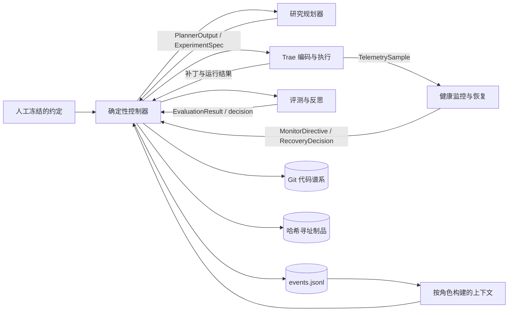

**简体中文** | [English](README.md)

# TacoRank

TacoRank 是一个面向 KuaiRand-Pure 的确定性、全程留证的自动化推荐系统研究框架。它把研究规划、基于 Trae 的代码生成、受控 CPU 执行、故障恢复、受保护评测、持久化记忆、收敛判断与最终提交检查连接成一个可复现的工作流。

> **状态：**完整的 CPU 工作流已经实现。确定性测试套件已通过；一次有界生产运行已完成至官方提交检查；另一次真实回归运行已正确进入第二轮研究迭代。运行前请先阅读[验证状态](#验证状态)了解证据边界，并查看[当前限制](#当前限制)。

## 目录

- [功能特性](#功能特性)
- [快速开始](#快速开始)
- [使用智能体协助操作](#使用智能体协助操作)
- [系统架构](#系统架构)
- [运行要求](#运行要求)
- [安装](#安装)
- [配置与端到端运行](#配置与端到端运行)
- [仅验证 Trae 编码](#仅验证-trae-编码)
- [运行操作](#运行操作)
- [数据集与评测约定](#数据集与评测约定)
- [仓库结构](#仓库结构)
- [团队职责](#团队职责)
- [测试](#测试)
- [验证状态](#验证状态)
- [安全性与可复现性](#安全性与可复现性)
- [参与开发](#参与开发)
- [故障排查](#故障排查)
- [当前限制](#当前限制)
- [文档](#文档)
- [许可证](#许可证)

## 功能特性

- 完整的“研究员 → Trae 编码 ↔ 有界实现校验器 → Gate A → CPU 执行 → Gate B → 评测 → 反思”循环。
- 唯一的确定性控制器负责工作流状态、预算、恢复、收敛、晋级、回滚和最终选择。
- 使用 DeepSeek 进行研究规划与最多 5 轮的“方案到代码”校验，并以固定版本的 Trae 作为生产编码工作器；隔离的测试替身只用于测试。
- 一次性 Git worktree、受保护路径检查、符号化执行命令、Docker 隔离、资源限制与类型化恢复决策。
- 追加写入、哈希链保护的事件账本，以及可重放状态、不可变证据制品和可复现派生报告。
- 严格遵循 KuaiRand-Pure 评测：基于 `long_view` 的用户内排序、受保护 GAUC 与 nDCG@5、无标签 test 推理及官方提交检查。

## 快速开始

完成[安装](#安装)和[部署配置](#配置与端到端运行)后，在仓库根目录运行完整自动化工作流：

```bash
.venv/bin/tacorank run \
  --config .tacorank/deployment/run-config.json \
  --live-config .tacorank/deployment/live-adapters.json
```

这是标准端到端入口。系统每次只运行一个实验；每一轮规划上下文都从持久化记忆重新构建；命中冻结的收敛规则或资源上限后停止，并自动完成所选 test 提交的最终化。

## 使用智能体协助操作

[`AGENTS.md`](AGENTS.md) 是供编码智能体读取的操作手册。它说明系统权限与安全边界、开发测试、Trae-only 真实验证、完整生产配置、监控、恢复、最终化、账本校验、输出检查，以及智能体必须汇报的证据。

你可以向理解当前仓库的编码智能体发送以下指令：

> 完整阅读 `AGENTS.md`，检查当前仓库状态，并协助我配置和运行 TacoRank 工作流。严格遵守其中的凭证和数据边界，用直接证据验证每个阶段；在满足我要求的完成条件前，不要宣称任务已经完成。

该手册明确区分三种证据等级：确定性开发测试、真实 Trae-only 编码验证，以及完整的实时自动化 ML 运行。在智能体开始模型调用、数据下载、Docker 构建或长时间 CPU 执行前，应先告诉它需要哪一种验证等级。

## 系统架构



TacoRank 有三类相互独立的权威来源：

- `contract/COMPETITION.md` 与 `PROTECTED_PATHS.md` 中由人工冻结的规则；
- `runs/<run_id>/events.jsonl` 中的动态证据；
- Git 中的精确代码谱系。

只有控制器可以追加事件或修改工作流状态。各角色组件只返回类型化值，不能自行晋级候选、修改预算、读取受保护标签或覆盖评测器结果。生成的状态、报告、经验和实验图都是可重放视图，并非新的事实来源。

## 运行要求

| 依赖 | 要求 | 用途 |
| --- | --- | --- |
| Git | 支持 submodule 与 worktree | 固定 starter kit 版本并隔离候选分支 |
| Python | 3.9 或更高 | TacoRank CLI 与控制平面 |
| Python | 3.12.x | 由 setup 创建的隔离 Trae 固定运行时 |
| Docker | 正在运行的兼容 Docker 守护进程 | 加固 Trae 编辑工具与 CPU 候选执行 |
| DeepSeek | 可访问目标模型的 `DEEPSEEK_API_KEY` | 研究规划、Trae 编码与有界实现校验 |
| KuaiRand-Pure | 本地官方数据，或允许 setup 下载的网络 | 训练、评测和生成提交 |

实时工作流当前仅使用 CPU。在 macOS 上可使用 Docker Desktop，或 Colima 等兼容 Docker 的本地守护进程。

## 安装

连同官方 starter-kit submodule 一起克隆仓库，然后创建虚拟环境并安装已审核的依赖：

```bash
git clone --recurse-submodules https://github.com/JellyPenguinnn/tacorank.git
cd tacorank
python3 -m venv .venv
.venv/bin/python -m pip install --upgrade pip
.venv/bin/python -m pip install -r requirements-dev.txt
.venv/bin/python -m pip install --no-deps -e .
.venv/bin/tacorank --help
```

主仓库和 starter-kit submodule 都需要相应的仓库访问权限。请使用已经认证的 HTTPS 或获准的 SSH 配置，绝不要把 token 写入远程 URL。若克隆时没有拉取 submodule，请运行：

```bash
git submodule update --init --recursive
```

## 配置与端到端运行

生产 setup 必须从没有 tracked 修改的干净 checkout 执行，这样 Git 基线、受保护清单、数据视图、Docker 镜像和生成配置才能绑定同一个 commit。每次独立运行都应使用唯一的 run ID。

1. 在 shell 中导出凭证。绝不要把它存入仓库文件。

   ```bash
   export DEEPSEEK_API_KEY='your-key'
   ```

2. 准备官方数据、基线、固定 Trae 运行时、Docker 镜像、受保护视图和哈希绑定配置。

   ```bash
   .venv/bin/tacorank setup-live \
     --run-id run_001 \
     --download-data
   ```

   如果官方数据已存在，请去掉 `--download-data`，并传入当前 checkout 内部的绝对非符号链接路径，例如 `--data-dir /absolute/path/to/tacorank/KuaiRand-Pure/data`。如果 `PATH` 中没有 Python 3.12 或 Docker，请通过 `--python312` 和 `--docker` 传入其规范化可执行文件路径。

3. 执行不会创建运行状态的生产预检。

   ```bash
   .venv/bin/tacorank preflight \
     --config .tacorank/deployment/run-config.json \
     --live-config .tacorank/deployment/live-adapters.json
   ```

   Setup 会把经过哈希验证的官方 FM 预测放入每个候选评分视图，并生成可执行基线一致性回执。Preflight 除了验证干净的 Git 基线和 submodule、冻结约定、数据清单、官方评测器、Trae 安装与模型访问、Docker 运行时、只读编辑工具挂载、执行环境和严格输出配额外，还会验证当前 `solution/candidate.py` 在 smoke、proxy、full 与 final 路径上仍能逐字节复现 FM 预测。成功结果会包含 `"ledger_created": false`。

4. 启动完整自动化循环。

   ```bash
   .venv/bin/tacorank run \
     --config .tacorank/deployment/run-config.json \
     --live-config .tacorank/deployment/live-adapters.json
   ```

`setup-live` 会把不含凭证的生成文件写入被 Git 忽略的 `.tacorank/`。API key 仅通过环境变量传给研究 provider 和隔离的 Trae 子进程，不会写入配置、prompt、日志、trajectory、fixture 或 artifact。

## 仅验证 Trae 编码

在下载数据或运行 ML 训练前，可以先验证生产编码路径。此模式仍然需要 Docker，因为 Trae 编辑工具使用与完整工作流相同的加固边界。

```bash
.venv/bin/tacorank setup-trae
.venv/bin/tacorank trae-preflight \
  --config .tacorank/trae/trae-deployment.json \
  --local-only

export DEEPSEEK_API_KEY='your-key'
.venv/bin/tacorank trae-preflight \
  --config .tacorank/trae/trae-deployment.json
.venv/bin/tacorank trae-run-example \
  --config .tacorank/trae/trae-deployment.json \
  --input examples/trae/experiment-spec.json
```

本地 preflight 会在不读取凭证的情况下检查固定 Trae 运行时和 Docker 工具边界。实时 preflight 会向 DeepSeek 认证，并以 high reasoning 验证 `deepseek-v4-flash` 访问。示例会在一次性 worktree 中生成真实补丁，按原始 ExperimentSpec 完成最多 5 轮有界校验/修订并执行 Gate A，随后有意在访问数据、训练、评测或创建账本之前停止。

## 运行操作

所有生命周期命令必须使用同一组冻结部署配置：

```bash
# 仅从持久化规划检查点继续。
.venv/bin/tacorank resume \
  --config .tacorank/deployment/run-config.json \
  --live-config .tacorank/deployment/live-adapters.json

# 检查并校验持久化状态。
.venv/bin/tacorank status --run-id run_001 --repository-root .
.venv/bin/tacorank validate-ledger --run-id run_001 --repository-root .
.venv/bin/tacorank rebuild-views --run-id run_001 --repository-root .

# 如果自动最终化没有完成，对已停止运行执行最终化。
.venv/bin/tacorank finalize \
  --config .tacorank/deployment/run-config.json \
  --live-config .tacorank/deployment/live-adapters.json
```

`resume` 只会修复最后一条不完整 JSONL 片段，验证冻结的 run identity，并从无歧义的 `planning` 或 `planner_context` 检查点继续。在外部适配器执行中的模糊阶段，它会 fail closed。对已成功最终化的运行，`finalize` 是幂等的。

每次运行都会写入以下被 Git 忽略的证据树：

```text
runs/<run_id>/
  events.jsonl                 权威追加写入证据
  state.json                   可重放状态投影
  STATUS.md                    便于人工阅读的状态
  contexts/                    不可变角色上下文
  lessons/                     经验和索引投影
  experiment-graph/            图与研究方向视图
  artifacts/                   不可变尝试证据
  reports/                     结果和资源投影
```

## 数据集与评测约定

Starter 资源位于 tracked 的 `KuaiRand-Pure/` 和固定版本的 `kuairand-starter-kit` submodule 中。下载的数据会被明确排除在 Git 之外。

评测是在 KuaiRand-Pure 已曝光记录上，以原生二元 `long_view` 为目标进行用户内排序。主分是 GAUC 与 nDCG@5 的平均值。候选代码不能修改或读取受保护评测器、split identity、评测/test label 或提交顺序；唯一暴露给候选的基线证据，是与当前 score 视图对应、经过哈希验证的逐行 FM 预测。Test 推理不含标签，也不能反馈给搜索。

可执行研究父模型是经 setup 验证的官方 FM 预测，而不是较弱的 popularity 近似。基线候选会逐字节复制该预测；获批的研究补丁通常应在其上学习一个有界、仅使用训练数据的残差。受保护评测还会记录不使用标签的可排序性、item 个性化、残差尺度以及与 FM 父模型相关性的诊断，使下一轮规划在不接触标签的情况下区分实现缺陷与无效假设。

数据准备、官方 split、基线复现、评测语义和提交检查详见 [`docs/KUAIRAND_STARTER_KIT.md`](docs/KUAIRAND_STARTER_KIT.md)。

## 仓库结构

```text
src/tacorank/
  agents/            研究规划适配器
  providers/         生产模型客户端与 provider 约定
  research/          搜索策略、实验图与方法组合
  memory/            追加写入事件存储与重放
  context/           有界、按角色构建的上下文
  orchestrator/      确定性状态机与适配器路由
  coding/            固定 Trae 适配器、语义校验器、prompt 与脱敏
  git/               实验 ref、补丁与一次性 worktree
  safety/            受保护清单、Gate A 与 Gate B
  execution/         符号化命令、Docker runner 与遥测
  sre/               实时健康观察
  recovery/          故障分类与有界恢复策略
  evaluation/        受保护指标、可信度与决策
  reflection/        证据关联研究经验
  reporting/         可复现派生视图
benchmarks/           KuaiRand 专用适配器
solution/             仅供编码智能体修改的候选区域
research/methods/     已审核实验方法卡
tests/                单元、集成与故障注入测试
contract/             人工冻结的竞赛约定
runs/                 被忽略的逐运行证据与报告
artifacts/            被忽略的共享 artifact 根目录
kuairand-starter-kit/ 官方 starter-kit Git submodule
```

## 团队职责

| 角色 | 职责 | 主要路径 |
| --- | --- | --- |
| Person 1 | 基于证据的规划与确定性搜索策略 | `agents/`、`providers/`、`research/` |
| Person 2 | Schema、账本、上下文、编排、预算、重放与 CLI | `schemas.py`、`memory/`、`context/`、`orchestrator/`、`cli.py` |
| Person 3 | Trae、Git worktree、Gate A、执行、遥测、artifact 与 Gate B | `coding/`、`git/`、`safety/`、`execution/` |
| Person 4 | 健康监控、故障分类与有界恢复 | `sre/`、`recovery/` |
| Person 5 | 受保护评测、可信度、最终选择与反思 | `evaluation/`、`reflection/`、`reporting/`、`benchmarks/` |

只有 Person 2 的控制器可以追加事件。其他组件拥有各自领域逻辑，并通过 `src/tacorank/schemas.py` 中的标准模型通信。

## 测试

集成前运行完整确定性测试套件：

```bash
PYTHONPATH=src:. PYTHONPYCACHEPREFIX=/tmp/tacorank-pycache \
  .venv/bin/python -m pytest -q
```

常用组件测试：

```bash
# 研究、schema、memory、context 与 orchestration
PYTHONPATH=src:. .venv/bin/python -m pytest \
  tests/research tests/schemas tests/memory tests/context tests/orchestrator

# 编码、Git、gate、执行与故障注入
PYTHONPATH=src:. .venv/bin/python -m pytest \
  tests/coding tests/git tests/safety tests/execution tests/failure_injection

# 健康监控与恢复
PYTHONPATH=src:. .venv/bin/python -m pytest \
  tests/sre tests/recovery tests/integration/test_recovery_lifecycle.py

# 评测、反思与报告
PYTHONPATH=src:. .venv/bin/python -m pytest \
  tests/evaluation tests/reflection tests/reporting
```

确定性测试不能替代实时 provider、Docker、数据或经过实际时间的多轮验收。报告结果时必须区分这些证据类别。

## 验证状态

截至 2026-08-30：

- 当前完整自动化测试套件通过 549 项测试，并有 11 项符合预期的平台跳过。
- 一次有界实时 CPU 运行使用了生产 DeepSeek 研究员、固定 Trae 工作器、加固 Docker runner 和官方 KuaiRand-Pure 数据。
- Trae 生成了仅修改 `solution/candidate.py` 的 pairwise BPR 候选；14 项 Gate A 检查全部通过，smoke 与 proxy 的 11 项 Gate B 检查也全部通过。
- 受保护 proxy 评测得到 GAUC `0.62112551`、nDCG@5 `0.51277198`、primary `0.56694875`，因此控制器正确剪枝该候选。
- 一实验预算选择了仍然最优的官方 FM 基线，生成了通过 TacoRank 和官方 checker 的、由 manifest 证明的 170,588 行 test 提交；20 事件账本成功重放。
- 另一次真实迭代回归运行完成了第一轮编码、Gate A、CPU smoke/proxy、Gate B、受保护评测与剪枝，随后持久化创建并提出 `exp_002`，进入新的 Trae 编码上下文。观察到跨轮继续行为后，该运行在第二轮编码期间被有意停止。
- 运行后取证发现，可编辑的 popularity 父模型得分为 `0.580721929`，而被单独评测的官方 FM 为 `0.601468756`。修复后的候选现在会逐字节复现官方 FM；对 124,909 行 full validation 的 CPU 重放得到 GAUC `0.6671326322`、nDCG@5 `0.5358048805`、primary `0.6014687564`。
- 针对 `exp_006` 的 DeepSeek 畸形工具参数路径，现有可执行兼容补丁测试已与 Waihong 的有界自恢复策略集成。工作器会保留脱敏证据以及准确的 provider token/耗时记账；畸形参数先在 Trae 内部纠正，若仍形成 adapter failure，则由该策略分类决定同 commit 重试、放弃或停止。新的真实 provider 验证仍需从干净 commit 重新生成 deployment，不能由这些确定性检查推断。
- 新增的确定性回归测试还覆盖最多 5 轮的方案到代码校验、校验器 JSON 修复、Trae 修订/耗尽路径、累计 token 与 artifact 记账、ExperimentSpec 目标文件约束，以及 Gate A 隔离入口导入。这些测试不表示历史付费运行已经使用新的校验器。

以上证据证明了真实集成的基线路径、跨迭代继续行为和当前可执行 FM 一致性，但并不证明经过实际时间的实时收敛，也不证明已经产生获胜候选。有界验收没有执行连续三次无提升的 full 迭代；由于候选在 proxy 失败，也没有进入 candidate-best clean reproduction 路径。确定性集成测试覆盖了这些控制路径。历史证据与范围见 [`docs/person3-handoff.md`](docs/person3-handoff.md)。

## 安全性与可复现性

- Gate A 在执行前把获准补丁绑定到 commit、diff、contract、受保护清单和数据 identity。
- Gate A 之前的实现校验器只检查代码是否忠实实现获准方案，最多执行 5 次校验（初始方案加最多 4 次有界 Trae 修订）；它不读取指标，也不能替代 Gate A、Gate B 或受保护评测。
- Gate A 会拒绝 `ExperimentSpec.target_files` 之外的累计改动，并在只读、禁网 Docker 边界内导入 `solution.candidate:run` 后才签发回执。
- Runner 只解析已审核的符号化命令，绝不接受 LLM 生成的原始 shell 命令。
- 候选代码在一次性 worktree 和资源受限的 CPU Docker 容器中运行，并受输出配额约束。
- Gate B 在评测前检查预测结构、行 identity、数值有限性、生产 commit、数据清单、命令与执行 seal。
- 预期故障会生成类型化、脱敏、哈希寻址证据；修复和同 commit 重试均有明确上限。
- DeepSeek 生成的畸形或截断工具参数会在 Trae 循环内转化为一次纠正步骤。如果 Trae 仍以失败结束，系统会把脱敏进程日志、可用的 trajectory、精确 provider token 与耗时写入账本；同一冻结编码任务只会从干净基线重试一次，之后仅放弃该实验而继续全局搜索。
- 主动违反完整性边界会终止运行，并保留在账本中。
- 收敛只统计终态、可信 full-fidelity 研究迭代，不统计 confirmation seed 执行。
- 最终化只选择 validation best；候选必须通过 clean reproduction；test identity 不会进入规划或评测反馈。
- 数据集、凭证、`.tacorank/`、提交、环境、运行账本和生成 artifact 均被忽略，绝不能提交。

## 参与开发

修改前请阅读 [`AGENTS.md`](AGENTS.md)，尤其注意：

1. 把行为保留在其所属子系统，并使用 `src/tacorank/schemas.py` 中的共享模型。
2. 保持 evaluator、split、prompt、seed、metric、protected path 与账本历史边界不变。
3. 共享 schema 或 handoff 变化时，同步更新 fixture 和跨组件测试。
4. 先运行最小相关测试，集成评审前再运行完整套件。
5. 不要把数据、secret、提交文件、生成证据或无关本地修改放入 commit。
6. Pull request 中记录受影响子系统、实际运行的命令、数据和 split 假设、seed、指标变化与剩余限制。

## 故障排查

| 现象 | 处理方式 |
| --- | --- |
| `setup-live` 报告 checkout 不干净 | 保留或提交预期 tracked 修改，再从需要作为实验基线的精确干净 commit 重新执行 setup。 |
| 找不到 Python 3.12 或 Docker | 通过 `setup-live --python312 ... --docker ...` 传入绝对可执行文件路径。 |
| Docker preflight 无法访问 daemon | 启动 Docker Desktop 或配置好的兼容 daemon，然后重新运行 `preflight`。 |
| DeepSeek 认证或模型预检失败 | 在当前 shell 导出有效 `DEEPSEEK_API_KEY`；绝不要把它写入 tracked 文件。 |
| Run ID 已有账本 | 在 `setup-live` 中选择新 `--run-id`；已完成账本不可变，也不能复用于新运行。 |
| `resume` 拒绝当前 phase | 最后持久化状态位于含歧义的外部适配器阶段；保留账本与证据并交由操作者检查，不要伪造结果。 |

## 当前限制

- 候选执行当前仅支持 CPU；在能够证明每容器 GPU 显存硬上限前，GPU 命令会 fail closed。
- 自动 resume 仅支持持久化规划检查点。若 provider、编码、执行或受保护评测调用期间崩溃，需要由操作者检查最后一个无歧义边界。
- 实时成功依赖当前机器、凭证、provider、Docker daemon、网络和官方数据。仅通过确定性测试不能证明这些外部依赖当前可用。
- 已最终化的实时验收被有意限制为一个实验。后续实时运行证明了进入第二轮迭代，但也在那里被有意停止；两者都不是经过实际时间的三轮收敛证据。

## 文档

- [`docs/HARNESS.md`](docs/HARNESS.md) — 控制平面、事件流、最终化与 schema 变更流程
- [`docs/person3-handoff.md`](docs/person3-handoff.md) — Trae、Git、gate、执行与实时验收证据
- [`docs/research/planning-and-search.md`](docs/research/planning-and-search.md) — 规划与搜索边界
- [`docs/KUAIRAND_STARTER_KIT.md`](docs/KUAIRAND_STARTER_KIT.md) — 数据集、基线、评测和提交细节
- [`TacoRank-Memory-Schema-v1.md`](TacoRank-Memory-Schema-v1.md) — 事件与记忆 schema 参考
- [`research/CURRENT_RUN_IMPROVEMENT_PLAN.md`](research/CURRENT_RUN_IMPROVEMENT_PLAN.md) — 已审核初始研究方向

## 许可证

仓库当前尚未声明整体许可证。不要假设 TacoRank 代码可以重新分发。所包含的 KuaiRand-Pure 资源仍受其上游条款约束；详见 [`KuaiRand-Pure/LICENSE`](KuaiRand-Pure/LICENSE) 和固定版本的 starter-kit submodule。
